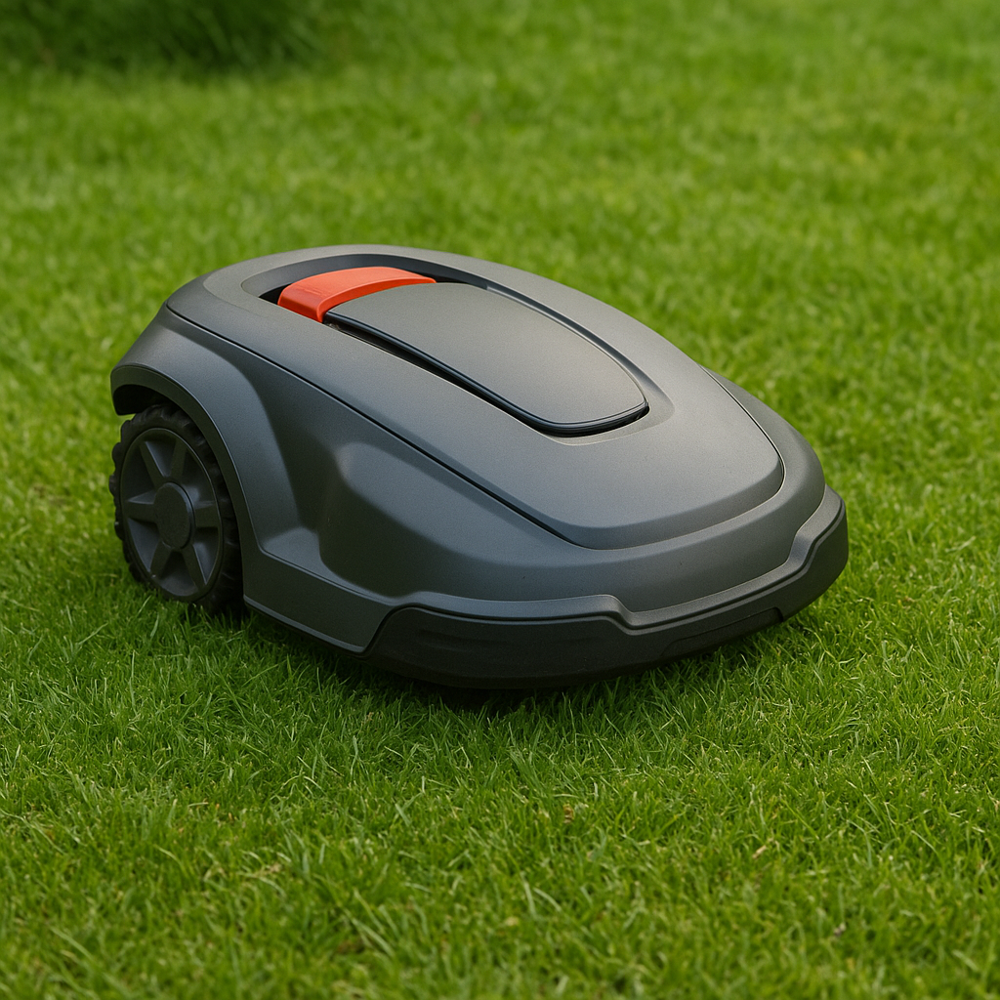

# Mower Path Planning System

<div align="center">
  
</div>

Autonomous lawn mower navigation, coverage path planning, simulation, and
mission tooling built on ROS 2 Jazzy and Nav2.

## Overview

This repository is a ROS 2 workspace for an autonomous mower. It includes:

- coverage path generation for mowing zones
- zone, risk-zone, and channel recording
- map generation for free space, risk maps, and channel maps
- Nav2 integration for path execution, localization, and docking
- Gazebo simulation assets
- STM32 UART hardware control through `ros2_control`
- Qt and rosbridge-facing adapters for operator/front-end control

The current package layout has been refactored around `mower_*` packages. Some
legacy ROS node names and service names remain for compatibility; see
[Naming And Compatibility](#naming-and-compatibility).

## Packages

| Package | Purpose |
| --- | --- |
| `mower_bringup` | Main launch files, Nav2, localization, docking, RViz, Gazebo simulation, rosbridge config |
| `mower_mission` | Zone/path recording, map management, coverage planning, navigation action wrapper, docking manager, Flutter adapter |
| `mower_interface` | Custom ROS messages, services, and actions |
| `mower_coverage_core` | Optional Rust/PyO3 coverage-planning backend |
| `mower_controller` | Real robot `ros2_control` hardware interface for STM32 UART motor/blade control |
| `mower_description` | URDF/Xacro robot description and mesh assets |
| `mower_teleop` | Keyboard and joystick teleoperation helpers |
| `mower_qt` | PyQt operator panel and STM32 UART monitor |
| `wit_ros2_imu` | WIT IMU ROS 2 node |
| `turtlebot3_mapviz` | Mapviz support package |

## Requirements

- ROS 2 Jazzy
- Ubuntu 24.04 recommended for native ROS 2 Jazzy development
- Docker / Docker Compose for containerized development and runtime builds
- Python 3.10+
- Rust toolchain and `maturin` if building `mower_coverage_core`

## Build

Install dependencies:

```bash
make deps
```

Build the full workspace:

```bash
make build
```

Build a release workspace:

```bash
make build-release
```

Build a simulation-focused workspace while skipping real hardware/Rust packages:

```bash
make build-sim
```

Source the workspace after building:

```bash
source install/setup.bash
```

## Common Commands

Start the Qt operator panel:

```bash
make run
```

Start mission nodes:

```bash
make mission
```

Start mission nodes with a temporary dock pose publisher:

```bash
make mission-docking-temp
```

Start AprilTag docking perception:

```bash
make apriltag-docking
```

Start RViz:

```bash
make rviz
```

Start keyboard teleop:

```bash
make teleop-keyboard
```

Start blade joystick teleop:

```bash
make blade-teleop-joy
```

## Simulation

Start Gazebo simulation:

```bash
make sim-gazebo
```

Start Gazebo with the empty test world:

```bash
make sim-gazebo-empty
```

Start the coverage mission side without launching Gazebo:

```bash
make sim-coverage-system
```

Start both simulation and coverage system targets:

```bash
make sim-coverage-test
```

If Gazebo needs remote models cached inside the dev container:

```bash
make sim-prefetch-gazebo-models
```

## Runtime Launches

Real robot bringup:

```bash
ros2 launch mower_bringup mower.launch.py use_sim_time:=false
```

Simulation bringup:

```bash
ros2 launch mower_bringup sim_with_nav.launch.py use_sim_time:=true
```

Mission services:

```bash
ros2 launch mower_mission mission.launch.py
```

Coverage path execution currently uses the `nav_action_server` executable:

```bash
ros2 run mower_mission nav_action_server
```

Rosbridge websocket:

```bash
ros2 launch mower_bringup rosbridge.launch.py
```

## Coverage Workflow

Typical service flow:

```bash
ros2 service call /load_zone_list std_srvs/srv/Trigger {}
ros2 service call /create_free_space std_srvs/srv/Trigger {}
ros2 service call /create_risk_map std_srvs/srv/Trigger {}
ros2 service call /generate_coverage_path std_srvs/srv/Trigger {}
ros2 service call /zone_exec_path mower_interface/srv/ZoneExecPath "{zone_id: 1}"
```

Coverage parameters are owned by the `boustrophedon_coverage` node name for
backward compatibility:

- `strip_width_m`: mower cutting strip width, default `0.8`
- `waypoint_spacing_m`: generated waypoint spacing, default `0.2`
- `zigzag_angle_deg`: zigzag scan angle in degrees, default `0.0`, range `0.0`-`180.0`
- `unknown_as_obstacle`: treat unknown cells as obstacles, default `true`
- `min_safe_component_area_m2`: minimum retained safe component area, default `0.05`
- `coverage_pattern`: `zigzag` or `spiral`
- `coverage_backend`: `python` or `rust`
- `allow_backend_fallback`: fall back to Python if Rust backend is unavailable

Map inflation parameters are owned by `map_manage`:

- `inflate_radius_m`: inward free-space/risk inflation radius, default `0.55`
- `chennal_width_m`: legacy channel width parameter, default `0.6`

## Naming And Compatibility

The project has historical names that are still visible in ROS APIs. New
documentation and UI text should use the preferred names below, while legacy
names remain available until callers are migrated.

| Preferred name | Legacy/current compatibility name | Notes |
| --- | --- | --- |
| `mower_mission` package | `boustrophedon_coverage`, `path_record`, `maphub` | Old package concepts were merged into `mower_mission`; `boustrophedon_coverage` remains a node/executable alias. |
| `mower_bringup` package | `nav2_gps_waypoint_follower` | Launch/config assets now live under `mower_bringup`. |
| `mower_interface` package | `boustrophedon_coverage_interfaces`, `path_record_interface`, `nav2_action_interfaces` | Use `mower_interface` in new code. |
| Channel | `chennal` | Some ROS services, topics, and fields still use the old spelling during migration. |
| Cancel | `cencel` | Prefer `/cancel_nav2`; keep `/cencel_nav2` only as a legacy alias. |
| Spiral | `speiral.py` | Use `path_generators/spiral.py`; the misspelled module is legacy compatibility only. |

## Docker

Build the runtime image:

```bash
docker compose build
```

Start the runtime stack:

```bash
docker compose up -d
```

Enter the runtime container:

```bash
docker compose exec lawan_node bash
```

Development and simulation containers are defined under `.devcontainer/`.

The `mediamtx` service streams the robot cameras to the app over WebRTC (WHEP).
Start just the camera server with `docker compose up -d mediamtx`. See
[docs/webrtc_camera_streaming.md](docs/webrtc_camera_streaming.md) for details,
including how to attach a real camera (synthetic test patterns are used until
one is wired).

## Testing

Run the coverage planner unit tests:

```bash
pytest src/mower_mission/test
```

Run ROS/colcon tests from a ROS 2 environment:

```bash
colcon test
colcon test-result --verbose
```

## Repository Layout

```text
mower_path_planning/
├── .devcontainer/                  # Development, Gazebo, RViz, and Zenoh containers
├── docs/                           # Design notes and implementation specs
├── img/                            # README and documentation images
├── src/
│   ├── mower_bringup/              # Launch, Nav2, localization, simulation, docking
│   ├── mower_controller/           # Real robot hardware interface
│   ├── mower_coverage_core/        # Rust coverage backend
│   ├── mower_description/          # Robot model and assets
│   ├── mower_interface/            # ROS interfaces
│   ├── mower_mission/              # Mission logic and coverage planner
│   ├── mower_qt/                   # Operator panel
│   ├── mower_teleop/               # Teleoperation tools
│   ├── turtlebot3_mapviz/          # Mapviz support
│   └── wit_ros2_imu/               # IMU node
├── zone_record/                    # Saved zones, risk zones, and channel paths
├── Dockerfile
├── docker-compose.yaml
└── Makefile
```

## License

Most maintained packages declare Apache-2.0. Some legacy package metadata still
contains placeholder license text and should be cleaned up before release.

## Maintainer

- Maintainer: fxrbindi
- Email: edwards940428@gmail.com
