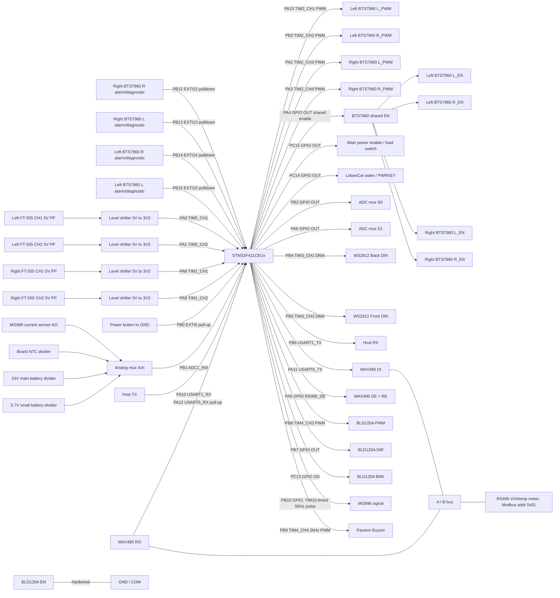

# Mower Robot Wire Map

本文以目前 `mower_robot_firmware.ioc` 的腳位配置為準，先整理接線規劃。
目前 `Core/*` 已產生程式碼尚未完全同步 `.ioc`，同步差異列在最後。

## 控制板資訊

| 項目 | 內容 |
| --- | --- |
| MCU | `STM32F411CEUx` |
| Package | `UFQFPN48` |
| Project | `mower_robot_firmware` |
| SYSCLK | 100 MHz |
| HSE | 25 MHz external oscillator |
| UART | `USART1` host, `USART6` RS485 charger, async |
| RTOS | FreeRTOS CMSIS V2 |

## 模組分類

以下分類以外部硬體/接線功能為主，方便接線、查線與後續整理 connector pinout。

| 模組 | 外部對象 | STM32 腳位 | 主要介面 | 說明 |
| --- | --- | --- | --- | --- |
| 左輪 BTS7960 | Left wheel 12 V gear motor driver | `PA15`, `PB3`, `PA4`, `PB15`, `PB14` | `TIM2_CH1/CH2` PWM, shared GPIO EN, EXTI | 左輪一顆 BTS7960，驅動 58 rpm / 139:1 馬達 |
| 右輪 BTS7960 | Right wheel 12 V gear motor driver | `PA2`, `PA3`, `PA4`, `PB13`, `PB12` | `TIM2_CH3/CH4` PWM, shared GPIO EN, EXTI | 右輪一顆 BTS7960，驅動 58 rpm / 139:1 馬達 |
| FT-555 Encoder | Left/Right FT-555 Encoder | `PA0`, `PA1`, `PA8`, `PA9` | `TIM5`, `TIM1` encoder interface | 16 PPR；FT-555 5 V 供電，A/B 為 PP push-pull，經電壓邏輯轉換器到 3.3 V |
| 電壓邏輯轉換器 | FT-555 A/B level shifter | `PA0`, `PA1`, `PA8`, `PA9` | 5 V to 3.3 V logic | 左右輪 encoder PP A/B 訊號降壓後進 STM32 |
| WS2812 燈條 | Front/Back LED strip | `PB4`, `PB5` | `TIM3_CH1/CH2` PWM + DMA | 800 kHz data，GRB 順序；後燈 16 顆，前燈 4 條串聯共 32 顆；LED 0-2 保留給狀態燈號 |
| Host UART | Host / controller | `PB6`, `PA10` | `USART1_TX/RX` + DMA | 115200 8N1，無硬體流控 |
| RS485 充電線電表 | 電壓 / 電流 / 溫度 RS485 電表（Modbus RTU） | `PA11`, `PA12`, `PA5` | `USART6_TX/RX` 9600 8N1, GPIO DE | MAX485 TTL 模組：`PA11`→DI、RO→`PA12`、`PA5`→DE+RE；讀電壓 / 電流 / 溫度。`PA7` 空著（原 SPI-CAN 已取消；`PA6` 改作 ADC mux S1） |
| 割草馬達 | BLD120A cutting motor driver | `PB8`, `PB7`, `PC13` | `TIM4_CH3` PWM, GPIO output, GPIO open-drain | BLD120A PWM 需求為 5 V、1-3 kHz；DIR 使用 `PB7`；BRK 使用 `PC13` open-drain，EN 硬體接 GND 常開 |
| MG996 Servo | MG996 / MG996R servo | `PB10` | GPIO + `TIM10` 中斷計時 | 50 Hz、500–2500 µs 脈波由 TIM10 update / CH1 compare 中斷產生（PB10 沒有可用的 timer channel）；servo 需外部 5-6 V 供電；host 用 `0x07` 控制 |
| 類比監控 / ADC MUX | Current / temperature / battery monitor | `PB1`, `PB2`, `PA6` | `ADC1_IN9`, GPIO select | 共用一個 ADC 腳量 MG996 電流、板溫 NTC、24 V 主電池、3.7 V 小電池 |
| 電流感測限位 | Current sensor module | ADC MUX CH0 | `ADC1_IN9` through mux | 量測 MG996 電流，超過門檻當作限位/卡住 |
| 板溫檢測 | Board NTC thermistor | ADC MUX CH1 | `ADC1_IN9` through mux | 10k NTC，量測板上溫度 |
| 電池電壓量測 | 24 V main / 3.7 V AON battery divider | ADC MUX CH2/CH3 | `ADC1_IN9` through mux | 電阻分壓後進 ADC，輸入不可超過 3.3 V |
| 輪速 PID / 設定儲存 | FT-555 encoder + internal Flash | `TIM5`, `TIM1`, Flash sector 7 | C++ module | 左右輪 PID 閉迴路；PID 參數存於 `0x08060000` |
| 電源按鍵 / 低功耗 | Power button / power hold | `PB0`, `PC14`, `PC15` | EXTI input, GPIO output | 長按 3 秒：停馬達、透過 UART `0x86` 通知 LubanCat 關機、等 ack（最多 30 s）後 `PC15` 切主電源；`LOW_POWER` 時按住 1 秒喚醒 LebanCat（`PC14` high 1 s）；關機後 STM32 由小電池 AON 供電。流程見 `UART_OPEN_LOOP_PROTOCOL.md` 的 `0x05 / 0x86` |
| 無源蜂鳴器 | Passive buzzer | `PB9` | `TIM4_CH4` PWM | 實測為無源蜂鳴器，DC 只會輕微一聲；用 TIM4_CH4 送 2 kHz 50% 方波發聲，duty 0 靜音 |
| 板載狀態 | Board status LED | `PC13` | 隨 BRK 動作 | `PC13` 已改給 BLD120A BRK；BlackPill 板載 LED 仍掛在 `PC13`，剎車時會亮，當作剎車指示；狀態燈改用 WS2812 LED 0-2 |
| Debug / Clock | SWD / HSE | `PA13`, `PA14`, `PH0`, `PH1` | SWD, HSE | 燒錄除錯與 25 MHz 外部時鐘 |
| 供電和共地 | BTS7960 / BLD120A / MG996 / current sensor / RS485 / FT-555 / level shifter / WS2812 / Host | - | Power, GND | 外部模組供電需與 MCU 共地 |

## 馬達配置總表

本車共有 3 顆主要驅動馬達：左輪、右輪、專門割草馬達。左輪與右輪是 12 V、58 rpm、139:1 減速馬達，各自由一顆 BTS7960 驅動；專門割草馬達由 BLD120A 驅動。另新增一顆 MG996 servo 作機構控制，使用電流感測判斷是否到限位或卡住。

| 馬達 | 馬達規格 | 驅動器 | 速度/位置回授 | 目前 STM32 控制腳 | 狀態 |
| --- | --- | --- | --- | --- | --- |
| 左輪馬達 | 12 V, 58 rpm, 139:1 | BTS7960 | Left FT-555, `PA0/PA1` (`TIM5`) | `PA15/PB3` PWM, shared `PA4` EN | 已配置 PWM/encoder，EN 與右輪共用 |
| 右輪馬達 | 12 V, 58 rpm, 139:1 | BTS7960 | Right FT-555, `PA8/PA9` (`TIM1`) | `PA2/PA3` PWM, shared `PA4` EN | 已配置 PWM/encoder，EN 與左輪共用 |
| 專門割草馬達 | 待補 | BLD120A | - | `PB8/TIM4_CH3` PWM, `PB7` DIR, `PC13` BRK | PWM 使用獨立 TIM4；EN 硬體常開，BRK 為韌體唯一快速停刀手段；label/應用層待同步 |
| 機構 servo | MG996 / MG996R | Servo PWM input | Current sensor, `PB1/ADC1_IN9` | `PB10` GPIO, `TIM10` 中斷計時 | `0x07/0x88` 已接上；以電流門檻當限位 |

## 接線總覽



## 腳位表

| 模組 | STM32 腳位 | `.ioc` 訊號 | Label | 方向 | 接線用途 |
| --- | --- | --- | --- | --- | --- |
| 左輪 FT-555 Encoder | `PA0` | `TIM5_CH1` encoder interface | - | input | Left FT-555 channel 1, 5 V through level shifter |
| 左輪 FT-555 Encoder | `PA1` | `TIM5_CH2` encoder interface | - | input | Left FT-555 channel 2, 5 V through level shifter |
| 電源按鍵 | `PB0` | `EXTI0` input, pull-up | `POWER_BUTTON_N` | input | Power button, active-low; long press shutdown, short press wake |
| 類比監控 / ADC MUX | `PB1` | `ADCx_IN9` / `ADC1_IN9` | `ADC_MUX_OUT` | input | Analog mux output to ADC |
| 類比監控 / ADC MUX | `PB2` | GPIO output | `ADC_MUX_S0` | output | Analog mux select bit 0 |
| 右輪 BTS7960 | `PA2` | `TIM2_CH3` PWM | `RL_Motor_PWM` | output | Right wheel BTS7960 L_PWM |
| 右輪 BTS7960 | `PA3` | `TIM2_CH4` PWM | `RR_Motor_PWM` | output | Right wheel BTS7960 R_PWM |
| 左右輪 BTS7960 | `PA4` | GPIO output | `BTS7960_Motor_EN` | output | Shared EN, connects to left/right BTS7960 `L_EN` and `R_EN` |
| RS485 充電模組 | `PA5` | GPIO output, initial low | `RS485_DE` | output | MAX485 `DE` + `RE`（短接），high = 發送、low = 接收；韌體在 TC 中斷放下 |
| 類比監控 / ADC MUX | `PA6` | GPIO output | `ADC_MUX_S1` | output | Analog mux select bit 1（原本指定 `PB11`，但 UFQFPN48 封裝沒有 PB11，2026-09-18 改到這裡） |
| 空腳 | `PA7` | - | - | - | 未使用（原 SPI-CAN 取消） |
| 右輪 FT-555 Encoder | `PA8` | `TIM1_CH1` encoder interface | - | input | Right FT-555 channel 1, 5 V through level shifter |
| 右輪 FT-555 Encoder | `PA9` | `TIM1_CH2` encoder interface | - | input | Right FT-555 channel 2, 5 V through level shifter |
| Host UART | `PA10` | `USART1_RX` | - | input | Host / controller TX |
| RS485 充電模組 | `PA11` | `USART6_TX` | - | output | RS485 module TXD（也是 BlackPill USB D-，用 RS485 時不能接 USB 資料線） |
| RS485 充電模組 | `PA12` | `USART6_RX` | - | input | RS485 module RXD（也是 BlackPill USB D+） |
| Debug / Clock | `PA13` | `SWDIO` | - | debug | SWD programming/debug |
| Debug / Clock | `PA14` | `SWCLK` | - | debug | SWD programming/debug |
| 左輪 BTS7960 | `PA15` | `TIM2_CH1` PWM | `LL_Motor_PWM` | output | Left wheel BTS7960 L_PWM |
| 左輪 BTS7960 | `PB3` | `TIM2_CH2` PWM | `LR_Motor_PWM` | output | Left wheel BTS7960 R_PWM |
| WS2812 燈條 | `PB4` | `TIM3_CH1` PWM + DMA | - | output | WS2812 back light DIN |
| WS2812 燈條 | `PB5` | `TIM3_CH2` PWM + DMA | - | output | WS2812 front light DIN |
| Host UART | `PB6` | `USART1_TX` | - | output | Host / controller RX |
| BLD120A 割草馬達 | `PB7` | GPIO output, open-drain | `Lawer_Mower_Mower` | output | BLD120A F/R；韌體固定拉低 = 割草方向，另一方向不可用 |
| BLD120A 割草馬達 | `PB8` | `TIM4_CH3` PWM | `BLD120A_PWM` | output | BLD120A PWM / speed control |
| 無源蜂鳴器 | `PB9` | `TIM4_CH4` PWM | `Buzzer_PWM` | output | Passive buzzer tone, 2 kHz 50% duty = on, 0% = off |
| MG996 Servo | `PB10` | GPIO output | `MG996_PWM` | output | Servo control pulse, 50 Hz, 0.5–2.5 ms high, timed by `TIM10` update / CC1 interrupts |
| 右輪 BTS7960 | `PB12` | `EXTI12` rising, pulldown | `RR_Motor_Alarm` | input | Right wheel BTS7960 R alarm/diagnostic |
| 右輪 BTS7960 | `PB13` | `EXTI13` rising, pulldown | `RL_Motor_Alarm` | input | Right wheel BTS7960 L alarm/diagnostic |
| 左輪 BTS7960 | `PB14` | `EXTI14` rising, pulldown | `LR_Motor_Alarm` | input | Left wheel BTS7960 R alarm/diagnostic |
| 左輪 BTS7960 | `PB15` | `EXTI15` rising, pulldown | `LL_Motor_Alarm` | input | Left wheel BTS7960 L alarm/diagnostic |
| BLD120A 割草馬達 | `PC13` | GPIO output, open-drain, initial low | `BLD120A_BRK` | output | BLD120A BRK, low = 剎車, high-Z = 放開；板載 LED 隨剎車亮 |
| LebanCat wake | `PC14` | GPIO output | `LEBANCAT_WAKE` | output | Short pulse or level control to wake LebanCat / PWRKEY |
| 主電源控制 | `PC15` | GPIO output | `MAIN_POWER_EN` | output | Controls main load switch / PMIC enable |
| Debug / Clock | `PH0` | HSE OSC_IN | - | clock | 25 MHz crystal/oscillator input |
| Debug / Clock | `PH1` | HSE OSC_OUT | - | clock | 25 MHz crystal/oscillator output |

## 左右輪 BTS7960 馬達驅動

左右輪各使用一顆 BTS7960。
韌體目前以雙 PWM 互斥方式控制：同一輪正轉命令只輸出 `*_L` PWM，反轉命令只輸出 `*_R` PWM，另一側 duty 設為 0。左右兩顆 BTS7960 的四個 EN 腳改成同一條 shared enable，由 `PA4` 一起控制。

命名規則：

- `LL_*`：Left wheel BTS7960 L side。
- `LR_*`：Left wheel BTS7960 R side。
- `RL_*`：Right wheel BTS7960 L side。
- `RR_*`：Right wheel BTS7960 R side。

TIM2 PWM 設定：

| 項目 | 值 |
| --- | --- |
| Timer | `TIM2` |
| Prescaler | `25 - 1` |
| Period | `200 - 1` |
| Timer clock | 100 MHz |
| PWM frequency | 約 20 kHz |

左右輪馬達規格：

| 項目 | 值 |
| --- | --- |
| Motor supply | 12 V |
| Output speed | 58 rpm |
| Gear ratio | 139:1 |
| Encoder | FT-555 |
| Encoder single-channel pulse | 16 PPR |

| 車輪 | BTS7960 端 | STM32 腳位 | Timer/GPIO | Label | 韌體使用 |
| --- | --- | --- | --- | --- | --- |
| 左輪 | L_PWM | `PA15` | `TIM2_CH1` | `LL_Motor_PWM` | 左輪正值命令 PWM |
| 左輪 | R_PWM | `PB3` | `TIM2_CH2` | `LR_Motor_PWM` | 左輪負值命令 PWM |
| 右輪 | L_PWM | `PA2` | `TIM2_CH3` | `RL_Motor_PWM` | 右輪正值命令 PWM |
| 右輪 | R_PWM | `PA3` | `TIM2_CH4` | `RR_Motor_PWM` | 右輪負值命令 PWM |
| 左右輪 | L_EN/R_EN 全部 | `PA4` | GPIO output | `BTS7960_Motor_EN` 建議改名 | 初始化後拉高，低電平時兩顆 BTS7960 全部 disable |

> 2026-09-11 實測：兩輪都用 `L_PWM` 驅動時右輪往車子前進方向、左輪往後退（馬達鏡像安裝）。韌體在 `motor.hpp` 以 `MOTOR_LEFT_DIRECTION_SIGN = -1` 把左輪反相，正命令 = 兩輪都前進；左輪 `L_PWM`/`R_PWM` 實際腳位不變，只是韌體對調。encoder 符號：右輪 -1、左輪 +1。shared EN 的代價是不能再單獨 disable 左輪或右輪；若任一 alarm 觸發，建議直接把 `PA4` 拉低或把全部 wheel PWM 清為 0。

## BTS7960 診斷 / Alarm

所有 alarm/diagnostic 腳位目前都是 pulldown、rising-edge EXTI。
BTS7960 alarm 為 high active；訊號拉高代表過流觸發。

> 2026-09-11 實測：BTS7960 模組的 `IS` 腳是類比電流感測輸出，不是數位 alarm。電源不限流時馬達啟動瞬間 `IS` 就超過 STM32 high 門檻，韌體把輸出切 0 再重啟，閉迴路轉速卡在一半。韌體已改成 `MOTOR_ALARM_DISABLES_OUTPUT 0`：alarm 只回報 `0x81` 旗標，不切輸出，過流保護靠 BTS7960 本身。若要真的用 `IS` 監控電流，需接 ADC（或 RC 濾波後設門檻），目前 ADC 腳位已用完。

| 車輪 | BTS7960 端 | STM32 腳位 | EXTI | Pull | Active level | 觸發原因 | Label |
| --- | --- | --- | --- | --- | --- | --- | --- |
| 右輪 | R alarm/diagnostic | `PB12` | `EXTI12` rising | pulldown | high active | 過流 | `RR_Motor_Alarm` |
| 右輪 | L alarm/diagnostic | `PB13` | `EXTI13` rising | pulldown | high active | 過流 | `RL_Motor_Alarm` |
| 左輪 | R alarm/diagnostic | `PB14` | `EXTI14` rising | pulldown | high active | 過流 | `LR_Motor_Alarm` |
| 左輪 | L alarm/diagnostic | `PB15` | `EXTI15` rising | pulldown | high active | 過流 | `LL_Motor_Alarm` |

## FT-555 Encoder

輪速編碼器使用 FT-555。`PA0/PA1` 的 `TIM5` encoder interface 對應左輪；`PA8/PA9` 的 `TIM1` encoder interface 對應右輪。

FT-555 規格：

| 項目 | 值 |
| --- | --- |
| Outline size | 直徑 35.5 mm |
| Single-channel output pulse | 16 PPR |
| Power supply voltage | 2.5-24 V |
| Actual encoder supply | 5 V |
| Output type | PP push-pull |
| STM32 input logic | 3.3 V through voltage level shifter |
| Supply current | 0.8-2.0 mA |
| Working temperature | -25 到 125 degC |
| Working humidity | 10-95%, non-condensing |

依 16 PPR 與 139:1 減速比推算：

| 項目 | 推算值 |
| --- | --- |
| 單路脈波 / 輪軸一圈 | 16 x 139 = 2224 pulses/rev |
| 若 A/B quadrature x4 解碼 | 2224 x 4 = 8896 counts/rev |
| 58 rpm 時單路脈波頻率 | 約 2.15 kHz |
| 58 rpm 時 x4 計數頻率 | 約 8.6 kcounts/s |

| Encoder | STM32 腳位 | Timer | Channel |
| --- | --- | --- | --- |
| Left FT-555 CH1 | `PA0` | `TIM5` | CH1 |
| Left FT-555 CH2 | `PA1` | `TIM5` | CH2 |
| Right FT-555 CH1 | `PA8` | `TIM1` | CH1 |
| Right FT-555 CH2 | `PA9` | `TIM1` | CH2 |

> 2026-09-11 實測：兩顆 FT-555 在正命令（`L_PWM`）驅動下計數為負，韌體以 `WHEEL_CONTROLLER_*_ENCODER_SIGN = -1` 反相，讓實測 rpm 與命令同號，否則 PID 會正回授飽和。50% duty 約 27 rpm、100% 約 60 rpm，與 58 rpm 規格相符。
>
> FT-555 目前使用 5 V 供電，A/B 已按 PP push-pull 輸出規劃。A/B 訊號需先經電壓邏輯轉換器降到 3.3 V 再接 STM32；不需要 open-drain/open-collector 類型的外部上拉配置。

## WS2812 燈條

TIM3 PWM 設定：

| 項目 | 值 |
| --- | --- |
| Timer | `TIM3` |
| Prescaler | `0` |
| Period | `125 - 1` |
| Timer clock | 100 MHz |
| WS2812 bit rate | 約 800 kHz |

| 燈條 | STM32 腳位 | Timer channel | DMA |
| --- | --- | --- | --- |
| 後燈 data | `PB4` | `TIM3_CH1` | `DMA1_Stream4` |
| 前燈 data | `PB5` | `TIM3_CH2` | `DMA1_Stream5` |

目前韌體後燈 `PB4` 是 16 顆、前燈 `PB5` 是 4 條串聯共 32 顆（`LED_NUM_BACK` / `LED_NUM_FRONT`），資料順序是 GRB。動畫以 16 為索引範圍，前燈每個索引對應 2 顆，讓前後燈同步。燈條電源需外部供電，並與 MCU 共地。BLD120A PWM 改用獨立的 `TIM4_CH3`，不再與 WS2812 共用 TIM3。

狀態燈號規劃使用既有 WS2812，不新增 STM32 GPIO。前燈與後燈同一個 index 同步顯示，讓車體前後都能看到系統狀態。建議保留 LED index `0`、`1`、`2` 給系統狀態，其他 index 才給一般燈效或方向燈使用。

| 狀態燈 | WS2812 index | 顏色/狀態 | 代表意義 | 優先順序 |
| --- | --- | --- | --- | --- |
| 第一顆 | `0` | 綠燈常亮 | LebanCat 4G 正常連線，且有網路 | 獨立 |
| 第二顆 | `1` | 綠燈常亮 | UART 通訊正常運作 | 獨立 |
| 第三顆 | `2` | 黃燈閃爍 | LebanCat 正在休眠 | 高 |
| 第三顆 | `2` | 黃燈常亮 | ROS2 正常運作中 | 低 |

第三顆黃燈若同時收到「LebanCat 休眠」與「ROS2 運作中」兩種狀態，以黃燈閃爍優先，因為休眠狀態比 ROS2 常態運作更需要提示。

> 待實作：目前 UART WS2812 command 只有整條燈條效果，還沒有獨立設定 LED 0-2 狀態燈的 mode。若要讓 LebanCat/ROS2 端控制這三顆狀態燈，需要新增 WS2812 status mode 或重新定義 payload；同時一般燈效不應覆蓋 LED 0-2。

## UART

| UART 訊號 | STM32 腳位 | 接到外部 |
| --- | --- | --- |
| `USART1_TX` | `PB6` | Host / controller RX |
| `USART1_RX` | `PA10` | Host / controller TX |

通訊參數目前在產生碼裡是 `115200 8N1`，無硬體流控。
若重新從 `.ioc` 產生程式碼，USART1 TX 會改到 `PB6`。

Host 是野火 LubanCat 2（RK3568）。它的 40-pin 排針串口是 UART3，裝置檔 `/dev/ttyS3`，預設關閉，要用 `sudo fire-config` 開 UART 或在 `/boot/uEnv/uEnv.txt` 把 uart3 那行的註解拿掉再重開機。接法：

| STM32 | LubanCat 2 40-pin |
| --- | --- |
| `PB6` `USART1_TX` | pin 10 `UART3_RXD` |
| `PA10` `USART1_RX` | pin 8 `UART3_TXD` |
| `GND` | pin 6 / 9 / 14 GND |

兩邊都是 3.3 V 邏輯，直接接，不要接 pin 2/4 的 5 V。ROS2 launch / xacro 的 device 預設已改成 `/dev/ttyS3`。

同一條 UART 也是韌體更新通道：flash sector 0-1（`0x08000000`, 32 KB）放 UART bootloader（`bootloader/`），app 從 sector 2（`0x08008000`）開始，sector 7 仍是 PID 設定。Host 用 `tools/mower_flash.py` 送 `0x0F` 讓 app 重開進 bootloader，再用 `0x10-0x14` 下載 `.bin`。Bootloader 期間 `PC13` 拉低（刀片剎車、板載 LED 亮）、`PA4-PA7` EN 拉低（`PA5-PA7` 現在沒接東西，無影響）。細節見 `BOOTLOADER.md`。

## RS485 充電線電表

原本規劃的 MCP2515 SPI-CAN 已取消（韌體從未接上），`PA11/PA12` 改成 `USART6` 接 RS485 收發模組，讀取串在充電器與電池之間的 **RS485 電壓 / 電流 / 溫度電表**。協議是標準 Modbus RTU（9600 8N1、站號預設 `0x01`）。

> 原本文件寫的是「數控 30V5A 帶 OFF」CC/CV 充電模組（廠商文件與 PC 工具在 `數控30V5A+2.0.zip`，不進 git），實際裝上的模組面板只有電壓、電流、溫度，沒有 CC/CV 可設。2026-09-19 實測對照面板（25.6 V / 0 A / 35 °C）確認 Reg0-2 的對應，Reg3/Reg4 是常數。充電本身由外接的 CC/CV 變壓器負責，電表只量。

收發器用常見的 MAX485 TTL 轉 RS485 小板（DI / DE / RE / RO 一側，VCC / GND / A / B 一側）：

| MAX485 模組腳 | 接到 | 說明 |
| --- | --- | --- |
| `VCC` | 5 V | MAX485 要 4.75 V 以上，不能接 3.3 V |
| `GND` | GND | 與 STM32、電表共地 |
| `DI` | `PA11` `USART6_TX` (AF8) | STM32 3.3 V 輸出，MAX485 TTL 門檻 2 V，直接接 |
| `RO` | `PA12` `USART6_RX` (AF8, 內部 pull-up) | 5 V TTL 輸出；`PA12` 是 5 V-tolerant 腳，直接接 |
| `DE` + `RE` 短接 | `PA5` `RS485_DE` GPIO | **一定要接到 PA5**，只短接不接會浮空，request 送不出去（症狀：`0x89` `age_ms=0xFFFF`、`EVER_SEEN=0`）；high = 發送、low = 接收；韌體送 request 前拉高，TC 中斷放下 |
| `A` | 電表 `A` / `485+` | 長線兩端各 120 Ω（藍色小板通常已內建 R7 120 Ω） |
| `B` | 電表 `B` / `485-` | |

若之後換成自動收發模組，把 `hardware_pins.hpp` 的 `CHARGER_RS485_USE_DE_PIN` 改 `0` 即可，`PA5` 就空出來。

Modbus holding registers（FC03 讀）：

| Reg | 內容 | 單位 | 實測 |
| --- | --- | --- | --- |
| 0 | 電壓（充電線 = 電池端） | x0.01 V | `2563` = 25.63 V，面板 25.6 V |
| 1 | 電流（充電電流） | x0.01 A | `0`，面板 0 A |
| 2 | 溫度（電表本身） | °C | `35`（34↔35 跳動），面板 35 °C |
| 3 | 不明，常數 | - | `11` |
| 4 | 不明，常數 | - | `48961` (`0xBF41`) |

範例：發 `01 03 00 00 00 05 85 C9`，回 `01 03 0A 0A 03 00 00 00 23 00 0B BF 41 <CRC>` = 25.63 V、0.00 A、35 °C。CRC 是 Modbus CRC-16（低位元組先送）。改站號用 FC06、站號 `0x00`，總線上只能有一台。

韌體：`Module/charger_rs485` 每 500 ms 輪詢一次 Reg0-4（`HAL_UARTEx_ReceiveToIdle_IT` 收回應，request 前先武裝 RX，所以 `RE` 接地讓 RO 回送 echo 也能用），`PA5` DE 在送 request 前拉高、`USART6` TC 中斷（最後一個 stop bit 送完）放下，結果經 `0x89` 每 50 ms 回給 host；主電源關閉時停止輪詢。純 codec 在 `Module/modbus_rtu`，可在 Mac 上跑單元測試。

注意事項：

- MAX485 用 5 V 供電、與 STM32 共地；`RO` 5 V 輸出接 `PA12`（5 V-tolerant）沒問題，其它非 FT 腳不要拿來接 RO。
- `PA11/PA12` 同時是 BlackPill 板載 USB-C 的 D-/D+，用 RS485 期間不能插 USB 資料線。
- Reg3/Reg4 意義不明，Reg5 以後沒探過；要探用 `01 03 00 00 00 08`（讀 8 個），看回覆有幾個暫存器。
- 目前只讀不寫；`ModbusRtu_BuildWriteMultiple` 已備好，但這顆電表沒有可寫的設定。

## BLD120A 割草馬達

割草馬達驅動使用 BLD120A。PWM 輸入需求是 5 V logic、1-3 kHz。PWM 規劃使用 `TIM4_CH3`，目前文件對應到 `PB8`；方向腳使用 `PB7`；剎車腳 BRK 使用 `PC13`。EN 在硬體上直接接 GND (COM) 常開，不由 MCU 控制。

| BLD120A 功能 | STM32 腳位 | 訊號需求 | Label |
| --- | --- | --- | --- |
| PWM / speed control | `PB8` / `TIM4_CH3` | 5 V logic, 1-3 kHz PWM | `BLD120A_PWM` |
| DIR (F/R) | `PB7` | GPIO open-drain；low = 割草方向（唯一能轉的方向），high-Z 方向馬達不動 | `Lawer_Mower_Mower` |
| BRK | `PC13` | GPIO open-drain, low = 剎車, high-Z = 放開 | `BLD120A_BRK` |
| EN | 不接 MCU | 硬體接 GND (COM) 常開 | - |

BLD120A 的 EN / BRK / F/R 都是「短接到 COM 才動作」的輸入，驅動器內部上拉到 5 V：

| 端子 | 短接到 COM | 懸空 |
| --- | --- | --- |
| EN | 馬達運轉 | 馬達停止，自然滑行停車 |
| BRK | 快速剎車（電子剎車） | 正常運轉 |
| F/R | 反向 | 正向 |

BRK 設計要點：

- EN 已硬體常開，PWM 歸零只是自然滑行，刀片還會轉好幾秒；BRK 是韌體唯一能立刻停刀的路徑，急停、翻車、抬起偵測、長按關機都要直接拉 BRK。
- `PC13` 設為 open-drain，不用 push-pull，避免 3.3 V high 對上驅動器 5 V 上拉。`PC13` 是 5 V tolerant，可以直接接。
- `PC13` 驅動能力只有 3 mA，但這裡只需吸驅動器上拉電阻的電流，不到 1 mA，足夠。
- 開機 / reset 預設 `PC13` 輸出 low（剎車中），應用層初始化完成且收到割草命令後才釋放，避免上電瞬間刀片誤轉。
- BlackPill 板載 LED 掛在 `PC13`，拉低時會亮，剛好當「剎車中」指示；原本的板載狀態燈功能改用 WS2812 LED 0-2。

TIM4 PWM 設定建議：

| 項目 | 建議值 |
| --- | --- |
| Timer | `TIM4` |
| Channel | `TIM4_CH3` |
| STM32 pin | `PB8` |
| PWM target | 2 kHz, 落在 BLD120A 1-3 kHz 範圍內 |
| Prescaler | `250 - 1` (100 MHz timer clock / 250 = 400 kHz tick) |
| Period | `200 - 1` (400 kHz / 200 = 2 kHz；duty counts 0-200 對齊 `MOTOR_PWM_MAX_COUNTS`) |
| Duty range | 0-100% |

> 待處理：`PB8/TIM4_CH3` 已在 `.ioc` 標為 `BLD120A_PWM`，但仍需確認應用層已改用 `TIM4_CH3`。`PB6` 已作為 `USART1_TX`，不能再使用舊的 `PB6/TIM4_CH1`。

## MG996 Servo 與電流感測限位

MG996 / MG996R 使用一般 RC servo 控制訊號。因為目前硬體 timer 已分配給輪 PWM、encoder、WS2812 與 BLD120A PWM，文件先規劃 `PB10` 作 GPIO output，由韌體產生 software servo pulse。電流感測模組串在 MG996 供電路徑上，輸出先進 ADC 類比多工器，再由 `PB1/ADC1_IN9` 量測；韌體用電流門檻判定是否到限位或卡住。

MG996 控制：

| 項目 | 規劃 |
| --- | --- |
| Signal pin | `PB10` |
| `.ioc` mode | GPIO output, software servo pulse |
| Label | `MG996_PWM` |
| Pulse period | 20 ms, 50 Hz |
| Pulse high time | 約 1.0-2.0 ms，中心約 1.5 ms |
| Servo power | 外部 5-6 V，大電流電源 |
| Ground | Servo power GND 必須與 STM32 GND 共地 |

電流感測限位：

| 項目 | 規劃 |
| --- | --- |
| Sensor input | `PB1 / ADC1_IN9` |
| `.ioc` mode | ADC input through analog mux |
| ADC label | `ADC_MUX_OUT` |
| Mux channel | CH0, `ADC_MUX_S1:S0 = 00` |
| 用途 | 量測 MG996 電流，超過門檻視為限位/卡住 |
| 保護動作 | 停止 MG996 輸出命令，並回報 limit/overcurrent 狀態 |

韌體判斷建議：

- 先量測空載、正常移動、碰到限位時的 ADC 值，再決定 threshold。
- 過電流需持續一小段時間才判定，例如 `50-200 ms`，避免啟動瞬間浪湧誤判。
- 判定過電流後，立即停止 servo 命令，必要時退回一小段角度解除機構壓力。
- 若電流感測模組是類比輸出，輸出到 `PB1` 不可超過 3.3 V。
- 若電流感測模組只有 comparator digital output，可把 `PB1` 改成 GPIO/EXTI input，但 active level 需再確認。
- 因為 MG996 電流與其他慢速量測共用 ADC mux，這只能做軟體限位；若需要硬體級過流保護，需額外用 comparator、保險絲或電源開關保護。

## 類比監控 / 板溫 / 電池電壓

目前沒有多餘的外部 ADC 腳，所以使用 4-channel 類比多工器把多個慢速類比訊號切到 `PB1/ADC1_IN9`。建議使用 3.3 V 供電、低漏電的 analog mux，例如 TS5A 類、74HC4051/74HC4052 類；若使用 8-channel 4051，`S2` 可固定接 GND，只用前 4 個通道。

ADC mux 控制：

| 功能 | STM32 腳位 | `.ioc` Label | 說明 |
| --- | --- | --- | --- |
| ADC mux output | `PB1 / ADC1_IN9` | `ADC_MUX_OUT` | 類比多工器 common output |
| ADC mux select 0 | `PB2` | `ADC_MUX_S0` | channel select bit 0 |
| ADC mux select 1 | `PA6` | `ADC_MUX_S1` | channel select bit 1 |

通道配置：

| `S1:S0` | Mux channel | 量測項目 | 外部電路 |
| --- | --- | --- | --- |
| `00` | CH0 | MG996 current sense | 電流感測模組 analog output |
| `01` | CH1 | Board temperature | 10k NTC divider |
| `10` | CH2 | 24 V main battery voltage | 主電池電阻分壓 |
| `11` | CH3 | 3.7 V AON small battery voltage | 小電池原始電壓分壓，取 regulator 前 |

板溫 NTC 建議：

| 項目 | 建議 |
| --- | --- |
| Sensor | 10k NTC, B value 3950 常見型 |
| Divider | 10k 1% pull-up to 3.3 V, NTC to GND |
| ADC input | Mux CH1 |
| Placement | 放在電源轉換器、馬達驅動附近，避開大電流走線熱點太近的位置 |

24 V 主電池電壓分壓建議：

| 項目 | 建議值 |
| --- | --- |
| Rtop | 270 kOhm, 1% |
| Rbottom | 33 kOhm, 1% |
| Divider ratio | 33 / (270 + 33) = 0.1089 |
| ADC full-scale battery voltage | 約 30.3 V when ADC = 3.3 V |
| 24.0 V battery ADC voltage | 約 2.61 V |
| 25.2 V full battery ADC voltage | 約 2.74 V |
| Divider current | 約 83 uA at 25.2 V |

主電池最高充電電壓已確認為 `25.2 V`，這組 `270k/33k` 有足夠 ADC headroom。若未來改電池且最高電壓超過 30 V，例如 8S 鋰電到 33.6 V，Rtop 需改成 `330k` 或重新依最高電壓計算。

3.7 V 小電池電壓分壓建議：

| 項目 | 建議值 |
| --- | --- |
| Rtop | 100 kOhm, 1% |
| Rbottom | 300 kOhm, 1% |
| Divider ratio | 300 / (100 + 300) = 0.75 |
| ADC full-scale battery voltage | 約 4.4 V when ADC = 3.3 V |
| 3.7 V battery ADC voltage | 約 2.78 V |
| 4.2 V battery ADC voltage | 約 3.15 V |
| Divider current | 約 10.5 uA at 4.2 V |

小電池 CH3 建議量測 raw 3.7 V 鋰電池，也就是低靜態電流 3.3 V regulator 前的電池電壓；STM32 本身仍然只能接穩壓後的 `AON_3V3`。

電池換算：

```text
Vadc = adc_raw / 4095 * Vref
V24_MAIN = Vadc * (270 + 33) / 33
VAON_BAT = Vadc * (100 + 300) / 300
```

所有進 analog mux / ADC 的電壓都必須低於 3.3 V。

量測注意事項：

- 類比多工器必須由 3.3 V 供電，所有輸入不可超過 mux 供電範圍。
- `PB2/ADC_MUX_S0` 上電時不要外接強上拉；若需要預設 mux channel，使用弱下拉讓預設停在 CH0。
- 每次切換 `ADC_MUX_S0/S1` 後，建議等待 `1-5 ms` 再取 ADC，讓分壓與濾波電容穩定。
- 每個分壓輸出建議加 `10-100 nF` 到 GND 做低通濾波；24 V 主電池分壓輸出可再加 `1 kOhm` series resistor 與 ADC/mux 端保護，避免馬達雜訊尖峰直接打進 ADC。
- 24 V 主電池分壓若接在主電池常電上會有約 100 uA 待機耗電；若關機後不需要量 24 V，可把分壓接在 `MAIN_POWER_EN` 之後的主電源 rail。
- STM32 內部溫度感測可作 MCU die temperature 趨勢，但不等同板上環境溫度；本設計使用外部 NTC 當板溫。

## 無源蜂鳴器

實測（2026-09-10）手上的蜂鳴器是無源型：`PB9` 拉高只會輕微一聲，用 2 kHz 方波才會正常發聲。因此 `PB9` 改用 `TIM4_CH4` PWM 發聲，和 BLD120A 的 `TIM4_CH3` 共用同一個 timer，頻率固定 2 kHz。

| 功能 | STM32 腳位 | 模式 | Label | 接到 |
| --- | --- | --- | --- | --- |
| Buzzer tone | `PB9` | `TIM4_CH4` PWM, 2 kHz | `Buzzer_PWM` | 蜂鳴器正極 / 模組 `SIG` |

控制邏輯：

| `TIM4_CH4` duty | 蜂鳴器 |
| --- | --- |
| 50% | on，2 kHz 音 |
| 0% | off |

接線：

| 腳 | 接線 |
| --- | --- |
| `VCC` | 若是含驅動電晶體的模組，依模組規格接 3.3 V 或 5 V；裸蜂鳴器不需要 |
| `GND` | MCU GND |
| `SIG` / 正極 | `PB9 / Buzzer_PWM` |

> 裸無源蜂鳴器直接掛在 `PB9` 時電流由 GPIO 提供，需確認在 20 mA 以內；超過就加電晶體。音調固定 2 kHz 是因為 TIM4 頻率由 BLD120A PWM 決定；若之後需要變調，要另找 timer。

## 電源按鍵 / 低功耗電源切換

電源按鍵用 `PB0`，按鍵一端接 `PB0`，另一端接 GND，STM32 內部 pull-up。
STM32 需要接在 always-on 的 `AON_3V3`，關機後由 3.7 V 小電池經電源晶片降壓並透過防反灌二極體供電，STM32 進低功耗；LebanCat、馬達驅動、WS2812、MG996、RS485 充電模組 等高耗電模組由 24 V 主電池轉出的主電源 rail 供電，透過 `MAIN_POWER_EN` 控制。

| 功能 | STM32 腳位 | 模式 | Label | Active |
| --- | --- | --- | --- | --- |
| Power button | `PB0` | EXTI input, pull-up | `POWER_BUTTON_N` | low = pressed |
| LebanCat wake | `PC14` | GPIO output | `LEBANCAT_WAKE` | 待確認 LebanCat 端 active level |
| Main power enable | `PC15` | GPIO output | `MAIN_POWER_EN` | high = main power on |

建議電源架構：

```text
3.7 V 小電池 -> 低靜態電流降壓電源晶片 -> 防反灌二極體 -> AON_3V3 -> STM32

主電源 3.3 V rail -> 防反灌二極體 ----------------------^

24 V 主電池 -> DC/DC + load switch / PMIC -> main power rail -> LebanCat / WS2812 / MG996 / RS485 / sensors
                         ^
                         |
                   PC15 MAIN_POWER_EN
```

按鍵行為：

| 系統狀態 | 按鍵時間 | 動作 |
| --- | --- | --- |
| 正常運作 | >= 3 s | 關閉馬達 PWM、拉低 BLD120A BRK、拉低 BTS7960 shared EN、通知 LebanCat 關機/休眠、關閉主電源、STM32 進 STOP 低功耗 |
| 低功耗關機 | >= 1 s | STM32 從 EXTI 醒來，拉高 `MAIN_POWER_EN`，再用 `LEBANCAT_WAKE` 喚醒 LebanCat |
| 任意狀態 | < 50-100 ms | debounce 後忽略 |

低功耗注意事項：

- STM32 不能直接接 raw 3.7 V 鋰電池，因為充飽約 4.2 V；必須經低靜態電流降壓電源晶片後進 `AON_3V3`。
- 關主電源前，STM32 需要先把接到已斷電外設的 GPIO 設成 low 或 analog/input，避免從 GPIO 反向供電到外部模組。
- `PC15/MAIN_POWER_EN` 必須由 AON rail 驅動，否則主電源關掉後 STM32 會失去控制能力。
- 小電池降壓輸出和主電源轉出的 3.3 V 不能直接硬接；目前規劃用二極體防反灌。若使用一般二極體或肖特基，需把壓降算進 `AON_3V3`；若壓降太大，改用 ideal diode / power mux。
- 若要保留 `PB0` 作一般 EXTI wake，建議用 STOP mode；不要用 Standby，因為 STM32F411 的專用 wakeup pin 會受限，且 `PA0` 已用作左輪 encoder。
- `LEBANCAT_WAKE` 實際脈波寬度與 active level 需依 LebanCat 電源鍵/喚醒腳規格確認。
- `LEBANCAT_WAKE` 外部電路需有預設 inactive pull，避免 STM32 reset 或低功耗期間誤觸發。

## Debug / Clock / Status

| 功能 | STM32 腳位 | 說明 |
| --- | --- | --- |
| SWDIO | `PA13` | programming/debug |
| SWCLK | `PA14` | programming/debug |
| HSE OSC_IN | `PH0` | 25 MHz external oscillator |
| HSE OSC_OUT | `PH1` | 25 MHz external oscillator |
| Status LED | `PC13` | 已改為 `BLD120A_BRK` open-drain；板載 LED 剎車時亮，狀態燈改用 WS2812 LED 0-2 |

## 供電和共地

- MCU GPIO 只接控制訊號，不直接供馬達電源。
- BTS7960 馬達電源走大電流電源線，不經 MCU；`L_PWM`/`R_PWM`/shared `EN` 只接邏輯訊號。
- BTS7960、BLD120A、FT-555、電壓邏輯轉換器、WS2812、Host UART、RS485、MG996、電流感測模組、ADC mux、NTC、電池分壓需與 MCU 共地。
- BTS7960 模組 VCC 目前接 5 V（2026-09-10 實測）。5 V 時輸入緩衝 high 門檻規格 3.5 V，STM32 rail 實測只有約 2.9 V，馬達能轉但沒有餘裕；建議兩顆模組 VCC 改接 3.3 V，門檻降到約 2.3 V。
- FT-555 供電範圍是 2.5-24 V，目前 A/B encoder 使用 5 V 供電；A/B 是 PP push-pull 輸出，必須經電壓邏輯轉換器降到 3.3 V 後再進 STM32。
- BLD120A PWM 輸入需求是 5 V logic；STM32 `PB8/TIM4_CH3` 是 3.3 V 輸出，需加 3.3 V to 5 V 電壓邏輯轉換或確認 BLD120A 可接受 3.3 V high。
- BLD120A BRK 由 `PC13` open-drain 直接拉驅動器內部 5 V 上拉，不需電平轉換；EN 直接接 BLD120A 的 COM / GND。
- MG996 需使用外部 5-6 V 大電流電源，不可由 STM32 或板上 3.3 V 供電。
- 電流感測、板溫 NTC、電池分壓都經 ADC mux 進 `PB1/ADC1_IN9`，任一 mux input 不可超過 3.3 V。
- 電流感測模組若是 5 V 類比輸出，需分壓或選 3.3 V 相容模組。
- 24 V 主電池量測使用 ADC mux CH2，最高充電電壓 `25.2 V`，建議 `270k/33k` 分壓。
- 3.7 V 小電池量測使用 ADC mux CH3，建議在 regulator 前用 `100k/300k` 分壓量 raw battery。
- STM32 低功耗關機時由小電池降壓後供應 `AON_3V3`；主電源 rail 由 `PC15/MAIN_POWER_EN` 控制；主/小電源間用二極體防反灌。
- RS485 模組若是 5 V 邏輯，`RXD` 回 STM32 前需確認不會超過 3.3 V。
- 蜂鳴器實測為無源型，`PB9` 用 `TIM4_CH4` 2 kHz PWM 發聲；裸蜂鳴器直掛 GPIO 需確認電流在 20 mA 內。
- WS2812 建議由外部 5 V 供電；資料線接 `PB4`/`PB5`，LED index `0-2` 保留作系統狀態燈。
- BTS7960 alarm 為 high active，過流時拉高；目前 `.ioc` 設定 MCU 內部 pulldown 與 rising-edge EXTI。

## 與目前 `.ioc` / 產生碼的同步狀態

目前 `mower_robot_firmware.ioc` 已依照這份 `wire.md` 重新配置主要 pinout，但 `Core/*` 產生碼尚未重新由 CubeMX 產生。之後要讓韌體跟 `.ioc` 一致，需要重新產生或手動同步下列項目。

| 項目 | `.ioc` 目前規劃 | 目前產生碼狀態 |
| --- | --- | --- |
| BTS7960 shared EN | `PA4` 一條線接左右 BTS7960 的 `L_EN/R_EN` | 應用層已固定使用 `PA4` shared EN；`PA5/PA6/PA7` 已從 `.ioc` 釋放，目前空著 |
| RS485 充電模組 | `PA11/PA12` = `USART6` 9600 8N1 | `.ioc`、`usart.c`、`stm32f4xx_it.c` 已同步；`charger_rs485` 模組與 `0x89` 已接上，尚未有實物測試 |
| MG996 servo control | `PB10` GPIO + `TIM10`（1 µs tick、20 ms period、CH1 compare no output） | 已改成 TIM10 中斷產生脈波，jitter = 中斷延遲；`0x07` 命令 / `0x88` 狀態已接上，尚未接實物測 |
| Analog monitor ADC mux | `PB1/ADC1_IN9` = `ADC_MUX_OUT`, `PB2/PA6` = mux select（S1 原本是不存在的 PB11，CH2/CH3 之前不可能被選到，「四通道可讀」需重測） | 已新增 C++ wrapper；`ADC1` HAL 程式碼已手動補上（`Core/Src/adc.c`、`Core/Inc/adc.h`、HAL ADC driver、`HAL_ADC_MODULE_ENABLED`），CH0/CH1 實測可讀，CH2/CH3 需在 S1 接到 PA6 後重測；每次 update 先讀 VREFINT 算出實際 VDDA 再換算（`0x8A VDDA_CALIBRATED`），不再假設 3.3 V |
| MG996 current sense | ADC mux CH0 | 已新增 raw threshold 判定；threshold 需實測校正 |
| Board temperature | ADC mux CH1, 10k NTC divider | 已新增 NTC beta 換算；NTC 參數需確認 |
| Battery voltage | ADC mux CH2 = 24 V main battery, CH3 = 3.7 V AON small battery | 已新增分壓換算 wrapper，每 50 ms 由 `0x8A` 送給 host（x0.01 V）；分壓比需實測校正 |
| Wheel PID settings | internal Flash sector 7 at `0x08060000` | 已新增 C++ storage module；需實車調 PID |
| UART bootloader | sector 0-1 bootloader，app link 在 `0x08008000`，RAM `0x20000000` 前 32 bytes 為 boot mailbox | 已新增 `bootloader/`、`tools/mower_flash.py`、app `0x0F` handler；linker script、`system_stm32f4xx.c` VTOR、`main.c` 已改；尚未上板實測，bootloader 第一次要用 ST-Link 燒 |
| BLD120A PWM label / app binding | `PB8/TIM4_CH3`, label `BLD120A_PWM` | 需確認應用層是否使用 `TIM4_CH3` |
| BLD120A BRK | `PC13` GPIO open-drain, initial low, label `BLD120A_BRK` | `.ioc` 已改；`Core/*` 產生碼仍是舊的 PC13 push-pull 無 label，需重新產生或手動改 `gpio.c`/`main.h`；應用層尚未接 BRK |
| Passive buzzer | `PB9` = `TIM4_CH4`, label `Buzzer_PWM` | 實測為無源蜂鳴器；C++ wrapper 已改成 TIM4_CH4 2 kHz PWM 發聲 |
| Power button / low power | `PB0` EXTI pull-up, `PC14` `LEBANCAT_WAKE`, `PC15` `MAIN_POWER_EN` | 已新增 polling 狀態機 wrapper；實際 STOP low-power 進入點仍需接 task |
| Board module runtime | module init / 10ms maintenance | 已新增 `BoardModules_Init()` / `BoardModules_Update10ms()`，接上蜂鳴器、電源按鍵、ADC 監控、MG996 限位狀態 |
| WS2812 狀態燈 protocol | LED index `0-2` 保留給狀態燈 | 已新增狀態燈 wrapper；尚未自動接入 10ms runtime，避免和 UART 燈效搶 DMA |
| ros2_control 對接 | `ros2/mower_hardware` SystemInterface；`0x85` 改回累積 encoder 計數供里程計 | 韌體已改 `total_counts`；plugin、diff_drive 設定、xacro、launch 已加入 repo，尚未在 LebanCat 上 colcon build 驗證；`wheel_radius`/`wheel_separation` 待量 |
| WS2812 開機動畫 | `boot_animation.cpp`，約 1.9 s：點火後轉成白光常亮，直到 UART 燈效命令覆蓋；蜂鳴器點火時兩短聲、白光亮起一長聲 | 已接入 MotorTask 的 20 ms 燈條迴圈，`main.c` 在 init 完成後啟動；動畫期間 UART 燈效命令暫緩，結束後自動套用；亮度上限 110/255 |

## 待確認清單

- BTS7960 的 `L_PWM`/`R_PWM` 對應車體正反轉方向需實測確認。
- RS485 充電模組尚未到貨：到貨後先用 USB-RS485 從電腦確認站號與 Reg5+（OFF 開關），再接 STM32。
- MAX485 `DE`/`RE` 已由 `PA5` 控制；bootloader 期間 `PA5` 也是拉低（接收），不會佔住 bus。
- MG996 的實際供電電壓、最大電流與控制脈波範圍需確認。
- `PB10` servo 脈波已改由 `TIM10` 中斷計時；接上 servo 後用示波器確認 20 ms / 脈寬，並實測 MG996R 的 500 / 2500 µs 端點。
- 電流感測模組型式需確認：analog output 進 ADC mux CH0；digital comparator output 則需另找 GPIO/EXTI。
- 電流感測輸出電壓範圍需確認；進 ADC mux / STM32 ADC 前不可超過 3.3 V。
- 板溫 NTC 實際阻值、B value、放置位置需確認。
- 24 V 主電池最高充電電壓已確認為 `25.2 V`；目前 `270k/33k` 分壓可用。
- AON 小電池已規劃使用 ADC mux CH3 量測 raw 3.7 V 電池；需確認小電池類型、最低電壓門檻與充電/保護模組。
- ADC mux 型號需確認；mux 供電 3.3 V，所有 analog input 需在 0-3.3 V 範圍內。
- MG996 限位電流 threshold 與持續判定時間需實測校正。
- 左右輪 PID 預設值已加入韌體，但 Kp/Ki/Kd 需在實車上調整；確認後再寫入 internal Flash。調參走 host 端自動校正：Mower Studio「自動校正」按鈕 → `mower_path_planning` `pid_autotune_node`（開環 step → 一階模型 → SIMC PI → 閉環驗證 → 確認後 `0x04 persist=1`），韌體不用改，車要先架高。
- FT-555 A/B 已按 PP push-pull 輸出規劃；需確認選用的電壓邏輯轉換器可接受 5 V push-pull input 並輸出 3.3 V 給 STM32。
- BLD120A PWM 需求為 5 V、1-3 kHz；STM32 `PB8/TIM4_CH3` 是 3.3 V，需電平轉換或確認 BLD120A 可接受 3.3 V high。
- BLD120A BRK 已改用 `PC13` open-drain，EN 硬體接 GND 常開。2026-09-10 實測確認：duty 歸零同時 `PC13` 拉低，馬達瞬間煞住；BRK 低 = 剎車的極性正確。
- BLD120A 的 SV 由 `PB8` 直接接，不經電平轉換；實測 3.3 V PWM 20% 就會轉。注意 STM32 GND 必須和驅動器 COM 共地，否則 SV 會看到浮動電壓、馬達上電就自轉。
- BLD120A F/R (`PB7`) 已改 open-drain（2026-09-10）。實測 F/R 懸空（驅動器上拉 5 V）時馬達完全不動、無聲、無抖動；F/R 短接 COM 才轉。刀片只需單向，韌體改成正命令一律 `PB7` 拉低、負命令視為 0 剎車。另一方向不動的原因（霍爾線 / 相線對應或驅動器設定）待之後查。
- 應用層需接 BRK：急停 / 翻車 / 抬起 / 長按關機時拉低 `PC13`；開機預設剎車，收到割草命令後才釋放。
- 電源按鍵已加入 `.ioc`：`PB0/POWER_BUTTON_N`、`PC14/LEBANCAT_WAKE`、`PC15/MAIN_POWER_EN`；目前 C++ wrapper 已有長按/喚醒狀態機，但尚未接入 STOP low-power。
- `PB0/POWER_BUTTON_N` 為低有效按鍵，CubeMX 產生碼需確認為 `GPIO_MODE_IT_FALLING` 或 `GPIO_MODE_IT_RISING_FALLING`，不可只用 rising。
- `LEBANCAT_WAKE` 的 active level、需要保持多久、是否等同 PWRKEY 需確認。
- 小電池 `AON_3V3` 已決定用電源晶片降壓並用二極體防反灌；仍需確認電源晶片型號、二極體壓降/電流規格、24 V 主電源 DC/DC + load switch / PMIC。
- 蜂鳴器實測為無源型，`PB9` 改為 `TIM4_CH4` PWM 發聲；音調固定 2 kHz，跟 BLD120A PWM 共用 TIM4 頻率。
- WS2812 狀態燈號已規劃使用 LED index `0-2`，但 UART command/protocol 尚未支援獨立控制單顆狀態燈。
- 需決定一般 WS2812 燈效與狀態燈號的優先權；建議一般燈效避開 LED index `0-2`。
- 外部 PCB connector 腳位名稱尚未整理進專案，目前文件只到 STM32 pin level。
