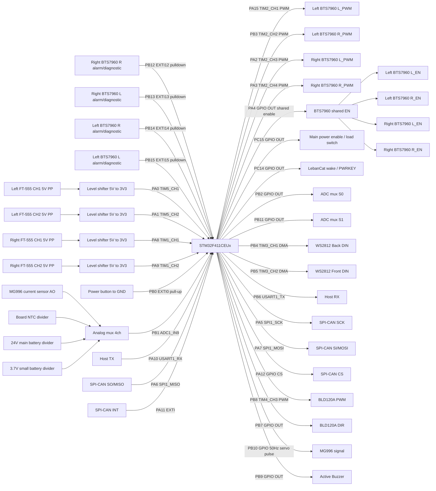

# Mower Robot Wire Map

本文以目前 `mower_robot_firmware.ioc` 的腳位配置為準，先整理接線規劃。
目前 `Core/*` 已產生程式碼尚未完全同步 `.ioc`，同步差異列在最後。

## 控制板資訊

| 項目 | 內容 |
| --- | --- |
| MCU | `STM32F411CEUx` |
| Package | `UFQFPN48` |
| Project | `mower_robot_firmware` |
| SYSCLK | 100 MHz |
| HSE | 25 MHz external oscillator |
| UART | `USART1`, async |
| RTOS | FreeRTOS CMSIS V2 |

## 模組分類

以下分類以外部硬體/接線功能為主，方便接線、查線與後續整理 connector pinout。

| 模組 | 外部對象 | STM32 腳位 | 主要介面 | 說明 |
| --- | --- | --- | --- | --- |
| 左輪 BTS7960 | Left wheel 12 V gear motor driver | `PA15`, `PB3`, `PA4`, `PB15`, `PB14` | `TIM2_CH1/CH2` PWM, shared GPIO EN, EXTI | 左輪一顆 BTS7960，驅動 58 rpm / 139:1 馬達 |
| 右輪 BTS7960 | Right wheel 12 V gear motor driver | `PA2`, `PA3`, `PA4`, `PB13`, `PB12` | `TIM2_CH3/CH4` PWM, shared GPIO EN, EXTI | 右輪一顆 BTS7960，驅動 58 rpm / 139:1 馬達 |
| FT-555 Encoder | Left/Right FT-555 Encoder | `PA0`, `PA1`, `PA8`, `PA9` | `TIM5`, `TIM1` encoder interface | 16 PPR；FT-555 5 V 供電，A/B 為 PP push-pull，經電壓邏輯轉換器到 3.3 V |
| 電壓邏輯轉換器 | FT-555 A/B level shifter | `PA0`, `PA1`, `PA8`, `PA9` | 5 V to 3.3 V logic | 左右輪 encoder PP A/B 訊號降壓後進 STM32 |
| WS2812 燈條 | Front/Back LED strip | `PB4`, `PB5` | `TIM3_CH1/CH2` PWM + DMA | 800 kHz data，GRB 順序；LED 0-2 保留給狀態燈號 |
| Host UART | Host / controller | `PB6`, `PA10` | `USART1_TX/RX` + DMA | 115200 8N1，無硬體流控 |
| SPI-CAN | MCP2515 SPI-CAN module | `PA5`, `PA6`, `PA7`, `PA11`, `PA12` | `SPI1`, GPIO CS, EXTI INT | `PA5-PA7` 由 motor EN 釋放後給 SPI-CAN 使用 |
| 割草馬達 | BLD120A cutting motor driver | `PB8`, `PB7` | `TIM4_CH3` PWM, GPIO output | BLD120A PWM 需求為 5 V、1-3 kHz；DIR 使用 `PB7` |
| MG996 Servo | MG996 / MG996R servo | `PB10` | GPIO software servo pulse | 50 Hz servo control pulse；servo 需外部 5-6 V 供電 |
| 類比監控 / ADC MUX | Current / temperature / battery monitor | `PB1`, `PB2`, `PB11` | `ADC1_IN9`, GPIO select | 共用一個 ADC 腳量 MG996 電流、板溫 NTC、24 V 主電池、3.7 V 小電池 |
| 電流感測限位 | Current sensor module | ADC MUX CH0 | `ADC1_IN9` through mux | 量測 MG996 電流，超過門檻當作限位/卡住 |
| 板溫檢測 | Board NTC thermistor | ADC MUX CH1 | `ADC1_IN9` through mux | 10k NTC，量測板上溫度 |
| 電池電壓量測 | 24 V main / 3.7 V AON battery divider | ADC MUX CH2/CH3 | `ADC1_IN9` through mux | 電阻分壓後進 ADC，輸入不可超過 3.3 V |
| 輪速 PID / 設定儲存 | FT-555 encoder + internal Flash | `TIM5`, `TIM1`, Flash sector 7 | C++ module | 左右輪 PID 閉迴路；PID 參數存於 `0x08060000` |
| 電源按鍵 / 低功耗 | Power button / power hold | `PB0`, `PC14`, `PC15` | EXTI input, GPIO output | 長按 3 秒關機；短按 1 秒喚醒 LebanCat；關機後 STM32 由小電池 AON 供電 |
| 有源蜂鳴器 | Active buzzer module | `PB9` | GPIO output | 模組已含電晶體，`PB9` 只接控制訊號；high = on, low = off |
| 板載狀態 | Board status LED | `PC13` | GPIO output | 板載狀態燈 |
| Debug / Clock | SWD / HSE | `PA13`, `PA14`, `PH0`, `PH1` | SWD, HSE | 燒錄除錯與 25 MHz 外部時鐘 |
| 供電和共地 | BTS7960 / BLD120A / MG996 / current sensor / SPI-CAN / FT-555 / level shifter / WS2812 / Host | - | Power, GND | 外部模組供電需與 MCU 共地 |

## 馬達配置總表

本車共有 3 顆主要驅動馬達：左輪、右輪、專門割草馬達。左輪與右輪是 12 V、58 rpm、139:1 減速馬達，各自由一顆 BTS7960 驅動；專門割草馬達由 BLD120A 驅動。另新增一顆 MG996 servo 作機構控制，使用電流感測判斷是否到限位或卡住。

| 馬達 | 馬達規格 | 驅動器 | 速度/位置回授 | 目前 STM32 控制腳 | 狀態 |
| --- | --- | --- | --- | --- | --- |
| 左輪馬達 | 12 V, 58 rpm, 139:1 | BTS7960 | Left FT-555, `PA0/PA1` (`TIM5`) | `PA15/PB3` PWM, shared `PA4` EN | 已配置 PWM/encoder，EN 與右輪共用 |
| 右輪馬達 | 12 V, 58 rpm, 139:1 | BTS7960 | Right FT-555, `PA8/PA9` (`TIM1`) | `PA2/PA3` PWM, shared `PA4` EN | 已配置 PWM/encoder，EN 與左輪共用 |
| 專門割草馬達 | 待補 | BLD120A | - | `PB8/TIM4_CH3` PWM, `PB7` DIR | PWM 使用獨立 TIM4，label/應用層待同步 |
| 機構 servo | MG996 / MG996R | Servo PWM input | Current sensor, `PB1/ADC1_IN9` | `PB10` software servo pulse | 新增規劃；以電流門檻當限位 |

## 接線總覽



## 腳位表

| 模組 | STM32 腳位 | `.ioc` 訊號 | Label | 方向 | 接線用途 |
| --- | --- | --- | --- | --- | --- |
| 左輪 FT-555 Encoder | `PA0` | `TIM5_CH1` encoder interface | - | input | Left FT-555 channel 1, 5 V through level shifter |
| 左輪 FT-555 Encoder | `PA1` | `TIM5_CH2` encoder interface | - | input | Left FT-555 channel 2, 5 V through level shifter |
| 電源按鍵 | `PB0` | `EXTI0` input, pull-up | `POWER_BUTTON_N` | input | Power button, active-low; long press shutdown, short press wake |
| 類比監控 / ADC MUX | `PB1` | `ADCx_IN9` / `ADC1_IN9` | `ADC_MUX_OUT` | input | Analog mux output to ADC |
| 類比監控 / ADC MUX | `PB2` | GPIO output | `ADC_MUX_S0` | output | Analog mux select bit 0 |
| 右輪 BTS7960 | `PA2` | `TIM2_CH3` PWM | `RL_Motor_PWM` | output | Right wheel BTS7960 L_PWM |
| 右輪 BTS7960 | `PA3` | `TIM2_CH4` PWM | `RR_Motor_PWM` | output | Right wheel BTS7960 R_PWM |
| 左右輪 BTS7960 | `PA4` | GPIO output | `BTS7960_Motor_EN` | output | Shared EN, connects to left/right BTS7960 `L_EN` and `R_EN` |
| SPI-CAN | `PA5` | `SPI1_SCK` | - | output | MCP2515 SCK |
| SPI-CAN | `PA6` | `SPI1_MISO` | - | input | MCP2515 SO / MISO |
| SPI-CAN | `PA7` | `SPI1_MOSI` | - | output | MCP2515 SI / MOSI |
| 右輪 FT-555 Encoder | `PA8` | `TIM1_CH1` encoder interface | - | input | Right FT-555 channel 1, 5 V through level shifter |
| 右輪 FT-555 Encoder | `PA9` | `TIM1_CH2` encoder interface | - | input | Right FT-555 channel 2, 5 V through level shifter |
| Host UART | `PA10` | `USART1_RX` | - | input | Host / controller TX |
| SPI-CAN | `PA11` | `EXTI11` input, pull-up | `CAN_INT` | input | MCP2515 interrupt, active-low |
| SPI-CAN | `PA12` | GPIO output, initial high | `CAN_CS` | output | MCP2515 chip select |
| Debug / Clock | `PA13` | `SWDIO` | - | debug | SWD programming/debug |
| Debug / Clock | `PA14` | `SWCLK` | - | debug | SWD programming/debug |
| 左輪 BTS7960 | `PA15` | `TIM2_CH1` PWM | `LL_Motor_PWM` | output | Left wheel BTS7960 L_PWM |
| 左輪 BTS7960 | `PB3` | `TIM2_CH2` PWM | `LR_Motor_PWM` | output | Left wheel BTS7960 R_PWM |
| WS2812 燈條 | `PB4` | `TIM3_CH1` PWM + DMA | - | output | WS2812 back light DIN |
| WS2812 燈條 | `PB5` | `TIM3_CH2` PWM + DMA | - | output | WS2812 front light DIN |
| Host UART | `PB6` | `USART1_TX` | - | output | Host / controller RX |
| BLD120A 割草馬達 | `PB7` | GPIO output | `Lawer_Mower_Mower` | output | BLD120A DIR, high = 正轉, low = 反轉 |
| BLD120A 割草馬達 | `PB8` | `TIM4_CH3` PWM | `BLD120A_PWM` | output | BLD120A PWM / speed control |
| 有源蜂鳴器 | `PB9` | GPIO output | `Active_Buzzer` | output | Active buzzer control, high = on |
| MG996 Servo | `PB10` | GPIO output | `MG996_PWM` | output | Servo control pulse, 50 Hz, about 1-2 ms high |
| 類比監控 / ADC MUX | `PB11` | GPIO output | `ADC_MUX_S1` | output | Analog mux select bit 1 |
| 右輪 BTS7960 | `PB12` | `EXTI12` rising, pulldown | `RR_Motor_Alarm` | input | Right wheel BTS7960 R alarm/diagnostic |
| 右輪 BTS7960 | `PB13` | `EXTI13` rising, pulldown | `RL_Motor_Alarm` | input | Right wheel BTS7960 L alarm/diagnostic |
| 左輪 BTS7960 | `PB14` | `EXTI14` rising, pulldown | `LR_Motor_Alarm` | input | Left wheel BTS7960 R alarm/diagnostic |
| 左輪 BTS7960 | `PB15` | `EXTI15` rising, pulldown | `LL_Motor_Alarm` | input | Left wheel BTS7960 L alarm/diagnostic |
| 板載狀態 | `PC13` | GPIO output | - | output | Board status LED |
| LebanCat wake | `PC14` | GPIO output | `LEBANCAT_WAKE` | output | Short pulse or level control to wake LebanCat / PWRKEY |
| 主電源控制 | `PC15` | GPIO output | `MAIN_POWER_EN` | output | Controls main load switch / PMIC enable |
| Debug / Clock | `PH0` | HSE OSC_IN | - | clock | 25 MHz crystal/oscillator input |
| Debug / Clock | `PH1` | HSE OSC_OUT | - | clock | 25 MHz crystal/oscillator output |

## 左右輪 BTS7960 馬達驅動

左右輪各使用一顆 BTS7960。
韌體目前以雙 PWM 互斥方式控制：同一輪正轉命令只輸出 `*_L` PWM，反轉命令只輸出 `*_R` PWM，另一側 duty 設為 0。左右兩顆 BTS7960 的四個 EN 腳改成同一條 shared enable，由 `PA4` 一起控制。

命名規則：

- `LL_*`：Left wheel BTS7960 L side。
- `LR_*`：Left wheel BTS7960 R side。
- `RL_*`：Right wheel BTS7960 L side。
- `RR_*`：Right wheel BTS7960 R side。

TIM2 PWM 設定：

| 項目 | 值 |
| --- | --- |
| Timer | `TIM2` |
| Prescaler | `25 - 1` |
| Period | `200 - 1` |
| Timer clock | 100 MHz |
| PWM frequency | 約 20 kHz |

左右輪馬達規格：

| 項目 | 值 |
| --- | --- |
| Motor supply | 12 V |
| Output speed | 58 rpm |
| Gear ratio | 139:1 |
| Encoder | FT-555 |
| Encoder single-channel pulse | 16 PPR |

| 車輪 | BTS7960 端 | STM32 腳位 | Timer/GPIO | Label | 韌體使用 |
| --- | --- | --- | --- | --- | --- |
| 左輪 | L_PWM | `PA15` | `TIM2_CH1` | `LL_Motor_PWM` | 左輪正值命令 PWM |
| 左輪 | R_PWM | `PB3` | `TIM2_CH2` | `LR_Motor_PWM` | 左輪負值命令 PWM |
| 右輪 | L_PWM | `PA2` | `TIM2_CH3` | `RL_Motor_PWM` | 右輪正值命令 PWM |
| 右輪 | R_PWM | `PA3` | `TIM2_CH4` | `RR_Motor_PWM` | 右輪負值命令 PWM |
| 左右輪 | L_EN/R_EN 全部 | `PA4` | GPIO output | `BTS7960_Motor_EN` 建議改名 | 初始化後拉高，低電平時兩顆 BTS7960 全部 disable |

> 待確認：BTS7960 的 `L_PWM`/`R_PWM` 對應車體實際正反轉方向需要實測確認。shared EN 的代價是不能再單獨 disable 左輪或右輪；若任一 alarm 觸發，建議直接把 `PA4` 拉低或把全部 wheel PWM 清為 0。

## BTS7960 診斷 / Alarm

所有 alarm/diagnostic 腳位目前都是 pulldown、rising-edge EXTI。
BTS7960 alarm 為 high active；訊號拉高代表過流觸發。

| 車輪 | BTS7960 端 | STM32 腳位 | EXTI | Pull | Active level | 觸發原因 | Label |
| --- | --- | --- | --- | --- | --- | --- | --- |
| 右輪 | R alarm/diagnostic | `PB12` | `EXTI12` rising | pulldown | high active | 過流 | `RR_Motor_Alarm` |
| 右輪 | L alarm/diagnostic | `PB13` | `EXTI13` rising | pulldown | high active | 過流 | `RL_Motor_Alarm` |
| 左輪 | R alarm/diagnostic | `PB14` | `EXTI14` rising | pulldown | high active | 過流 | `LR_Motor_Alarm` |
| 左輪 | L alarm/diagnostic | `PB15` | `EXTI15` rising | pulldown | high active | 過流 | `LL_Motor_Alarm` |

## FT-555 Encoder

輪速編碼器使用 FT-555。`PA0/PA1` 的 `TIM5` encoder interface 對應左輪；`PA8/PA9` 的 `TIM1` encoder interface 對應右輪。

FT-555 規格：

| 項目 | 值 |
| --- | --- |
| Outline size | 直徑 35.5 mm |
| Single-channel output pulse | 16 PPR |
| Power supply voltage | 2.5-24 V |
| Actual encoder supply | 5 V |
| Output type | PP push-pull |
| STM32 input logic | 3.3 V through voltage level shifter |
| Supply current | 0.8-2.0 mA |
| Working temperature | -25 到 125 degC |
| Working humidity | 10-95%, non-condensing |

依 16 PPR 與 139:1 減速比推算：

| 項目 | 推算值 |
| --- | --- |
| 單路脈波 / 輪軸一圈 | 16 x 139 = 2224 pulses/rev |
| 若 A/B quadrature x4 解碼 | 2224 x 4 = 8896 counts/rev |
| 58 rpm 時單路脈波頻率 | 約 2.15 kHz |
| 58 rpm 時 x4 計數頻率 | 約 8.6 kcounts/s |

| Encoder | STM32 腳位 | Timer | Channel |
| --- | --- | --- | --- |
| Left FT-555 CH1 | `PA0` | `TIM5` | CH1 |
| Left FT-555 CH2 | `PA1` | `TIM5` | CH2 |
| Right FT-555 CH1 | `PA8` | `TIM1` | CH1 |
| Right FT-555 CH2 | `PA9` | `TIM1` | CH2 |

> FT-555 目前使用 5 V 供電，A/B 已按 PP push-pull 輸出規劃。A/B 訊號需先經電壓邏輯轉換器降到 3.3 V 再接 STM32；不需要 open-drain/open-collector 類型的外部上拉配置。

## WS2812 燈條

TIM3 PWM 設定：

| 項目 | 值 |
| --- | --- |
| Timer | `TIM3` |
| Prescaler | `0` |
| Period | `125 - 1` |
| Timer clock | 100 MHz |
| WS2812 bit rate | 約 800 kHz |

| 燈條 | STM32 腳位 | Timer channel | DMA |
| --- | --- | --- | --- |
| 後燈 data | `PB4` | `TIM3_CH1` | `DMA1_Stream4` |
| 前燈 data | `PB5` | `TIM3_CH2` | `DMA1_Stream5` |

目前韌體資料結構中每條燈條是 16 顆 LED，資料順序是 GRB。燈條電源需外部供電，並與 MCU 共地。BLD120A PWM 改用獨立的 `TIM4_CH3`，不再與 WS2812 共用 TIM3。

狀態燈號規劃使用既有 WS2812，不新增 STM32 GPIO。前燈與後燈同一個 index 同步顯示，讓車體前後都能看到系統狀態。建議保留 LED index `0`、`1`、`2` 給系統狀態，其他 index 才給一般燈效或方向燈使用。

| 狀態燈 | WS2812 index | 顏色/狀態 | 代表意義 | 優先順序 |
| --- | --- | --- | --- | --- |
| 第一顆 | `0` | 綠燈常亮 | LebanCat 4G 正常連線，且有網路 | 獨立 |
| 第二顆 | `1` | 綠燈常亮 | UART 通訊正常運作 | 獨立 |
| 第三顆 | `2` | 黃燈閃爍 | LebanCat 正在休眠 | 高 |
| 第三顆 | `2` | 黃燈常亮 | ROS2 正常運作中 | 低 |

第三顆黃燈若同時收到「LebanCat 休眠」與「ROS2 運作中」兩種狀態，以黃燈閃爍優先，因為休眠狀態比 ROS2 常態運作更需要提示。

> 待實作：目前 UART WS2812 command 只有整條燈條效果，還沒有獨立設定 LED 0-2 狀態燈的 mode。若要讓 LebanCat/ROS2 端控制這三顆狀態燈，需要新增 WS2812 status mode 或重新定義 payload；同時一般燈效不應覆蓋 LED 0-2。

## UART

| UART 訊號 | STM32 腳位 | 接到外部 |
| --- | --- | --- |
| `USART1_TX` | `PB6` | Host / controller RX |
| `USART1_RX` | `PA10` | Host / controller TX |

通訊參數目前在產生碼裡是 `115200 8N1`，無硬體流控。
若重新從 `.ioc` 產生程式碼，USART1 TX 會改到 `PB6`。

## SPI-CAN 預留

STM32F411CEUx 本身沒有內建 CAN controller，若要接 CAN bus，使用外部 `MCP2515` SPI-CAN 模組。為了留出硬體 SPI，左右輪 BTS7960 的四個 EN 腳改成共用 `PA4`，釋放 `PA5/PA6/PA7` 給 `SPI1`。

| SPI-CAN 功能 | STM32 腳位 | 模式 | 接到模組 |
| --- | --- | --- | --- |
| SCK | `PA5` | `SPI1_SCK` | `SCK` |
| MISO | `PA6` | `SPI1_MISO` | `SO` / `MISO` |
| MOSI | `PA7` | `SPI1_MOSI` | `SI` / `MOSI` |
| CS | `PA12` | GPIO output | `CS` |
| INT | `PA11` | EXTI input | `INT` |
| RESET | 不接或另接空 GPIO | optional | `RESET` |

注意事項：

- SPI-CAN 模組與 STM32 需共地。
- 若模組邏輯是 5 V，需確認 SPI 腳位是否可接受 3.3 V high，且 `MISO` 回 STM32 不可超過 3.3 V。
- 已選 `MCP2515`。若買的是只有 MCP2515 controller 的裸板，還需要 CAN transceiver；若是常見 MCP2515 CAN module，通常板上會另外帶 transceiver，但仍需看實物確認。
- `PA5/PA6/PA7/PA11/PA12` 已加入 `.ioc` 的 SPI-CAN 配置；`CAN_INT` 為低有效，產生碼需確認為 falling-edge EXTI。

## BLD120A 割草馬達

割草馬達驅動使用 BLD120A。PWM 輸入需求是 5 V logic、1-3 kHz。PWM 規劃使用 `TIM4_CH3`，目前文件對應到 `PB8`；方向腳使用 `PB7`。

| BLD120A 功能 | STM32 腳位 | 訊號需求 | Label |
| --- | --- | --- | --- |
| PWM / speed control | `PB8` / `TIM4_CH3` | 5 V logic, 1-3 kHz PWM | `BLD120A_PWM` |
| DIR | `PB7` | GPIO output, high = 正轉, low = 反轉 | `Lawer_Mower_Mower` |

TIM4 PWM 設定建議：

| 項目 | 建議值 |
| --- | --- |
| Timer | `TIM4` |
| Channel | `TIM4_CH3` |
| STM32 pin | `PB8` |
| PWM target | 2 kHz, 落在 BLD120A 1-3 kHz 範圍內 |
| Example prescaler | `100 - 1` |
| Example period | `500 - 1` |
| Duty range | 0-100% |

> 待處理：`PB8/TIM4_CH3` 已在 `.ioc` 標為 `BLD120A_PWM`，但仍需確認應用層已改用 `TIM4_CH3`。`PB6` 已作為 `USART1_TX`，不能再使用舊的 `PB6/TIM4_CH1`。

## MG996 Servo 與電流感測限位

MG996 / MG996R 使用一般 RC servo 控制訊號。因為目前硬體 timer 已分配給輪 PWM、encoder、WS2812 與 BLD120A PWM，文件先規劃 `PB10` 作 GPIO output，由韌體產生 software servo pulse。電流感測模組串在 MG996 供電路徑上，輸出先進 ADC 類比多工器，再由 `PB1/ADC1_IN9` 量測；韌體用電流門檻判定是否到限位或卡住。

MG996 控制：

| 項目 | 規劃 |
| --- | --- |
| Signal pin | `PB10` |
| `.ioc` mode | GPIO output, software servo pulse |
| Label | `MG996_PWM` |
| Pulse period | 20 ms, 50 Hz |
| Pulse high time | 約 1.0-2.0 ms，中心約 1.5 ms |
| Servo power | 外部 5-6 V，大電流電源 |
| Ground | Servo power GND 必須與 STM32 GND 共地 |

電流感測限位：

| 項目 | 規劃 |
| --- | --- |
| Sensor input | `PB1 / ADC1_IN9` |
| `.ioc` mode | ADC input through analog mux |
| ADC label | `ADC_MUX_OUT` |
| Mux channel | CH0, `ADC_MUX_S1:S0 = 00` |
| 用途 | 量測 MG996 電流，超過門檻視為限位/卡住 |
| 保護動作 | 停止 MG996 輸出命令，並回報 limit/overcurrent 狀態 |

韌體判斷建議：

- 先量測空載、正常移動、碰到限位時的 ADC 值，再決定 threshold。
- 過電流需持續一小段時間才判定，例如 `50-200 ms`，避免啟動瞬間浪湧誤判。
- 判定過電流後，立即停止 servo 命令，必要時退回一小段角度解除機構壓力。
- 若電流感測模組是類比輸出，輸出到 `PB1` 不可超過 3.3 V。
- 若電流感測模組只有 comparator digital output，可把 `PB1` 改成 GPIO/EXTI input，但 active level 需再確認。
- 因為 MG996 電流與其他慢速量測共用 ADC mux，這只能做軟體限位；若需要硬體級過流保護，需額外用 comparator、保險絲或電源開關保護。

## 類比監控 / 板溫 / 電池電壓

目前沒有多餘的外部 ADC 腳，所以使用 4-channel 類比多工器把多個慢速類比訊號切到 `PB1/ADC1_IN9`。建議使用 3.3 V 供電、低漏電的 analog mux，例如 TS5A 類、74HC4051/74HC4052 類；若使用 8-channel 4051，`S2` 可固定接 GND，只用前 4 個通道。

ADC mux 控制：

| 功能 | STM32 腳位 | `.ioc` Label | 說明 |
| --- | --- | --- | --- |
| ADC mux output | `PB1 / ADC1_IN9` | `ADC_MUX_OUT` | 類比多工器 common output |
| ADC mux select 0 | `PB2` | `ADC_MUX_S0` | channel select bit 0 |
| ADC mux select 1 | `PB11` | `ADC_MUX_S1` | channel select bit 1 |

通道配置：

| `S1:S0` | Mux channel | 量測項目 | 外部電路 |
| --- | --- | --- | --- |
| `00` | CH0 | MG996 current sense | 電流感測模組 analog output |
| `01` | CH1 | Board temperature | 10k NTC divider |
| `10` | CH2 | 24 V main battery voltage | 主電池電阻分壓 |
| `11` | CH3 | 3.7 V AON small battery voltage | 小電池原始電壓分壓，取 regulator 前 |

板溫 NTC 建議：

| 項目 | 建議 |
| --- | --- |
| Sensor | 10k NTC, B value 3950 常見型 |
| Divider | 10k 1% pull-up to 3.3 V, NTC to GND |
| ADC input | Mux CH1 |
| Placement | 放在電源轉換器、馬達驅動附近，避開大電流走線熱點太近的位置 |

24 V 主電池電壓分壓建議：

| 項目 | 建議值 |
| --- | --- |
| Rtop | 270 kOhm, 1% |
| Rbottom | 33 kOhm, 1% |
| Divider ratio | 33 / (270 + 33) = 0.1089 |
| ADC full-scale battery voltage | 約 30.3 V when ADC = 3.3 V |
| 24.0 V battery ADC voltage | 約 2.61 V |
| 25.2 V full battery ADC voltage | 約 2.74 V |
| Divider current | 約 83 uA at 25.2 V |

主電池最高充電電壓已確認為 `25.2 V`，這組 `270k/33k` 有足夠 ADC headroom。若未來改電池且最高電壓超過 30 V，例如 8S 鋰電到 33.6 V，Rtop 需改成 `330k` 或重新依最高電壓計算。

3.7 V 小電池電壓分壓建議：

| 項目 | 建議值 |
| --- | --- |
| Rtop | 100 kOhm, 1% |
| Rbottom | 300 kOhm, 1% |
| Divider ratio | 300 / (100 + 300) = 0.75 |
| ADC full-scale battery voltage | 約 4.4 V when ADC = 3.3 V |
| 3.7 V battery ADC voltage | 約 2.78 V |
| 4.2 V battery ADC voltage | 約 3.15 V |
| Divider current | 約 10.5 uA at 4.2 V |

小電池 CH3 建議量測 raw 3.7 V 鋰電池，也就是低靜態電流 3.3 V regulator 前的電池電壓；STM32 本身仍然只能接穩壓後的 `AON_3V3`。

電池換算：

```text
Vadc = adc_raw / 4095 * Vref
V24_MAIN = Vadc * (270 + 33) / 33
VAON_BAT = Vadc * (100 + 300) / 300
```

所有進 analog mux / ADC 的電壓都必須低於 3.3 V。

量測注意事項：

- 類比多工器必須由 3.3 V 供電，所有輸入不可超過 mux 供電範圍。
- `PB2/ADC_MUX_S0` 上電時不要外接強上拉；若需要預設 mux channel，使用弱下拉讓預設停在 CH0。
- 每次切換 `ADC_MUX_S0/S1` 後，建議等待 `1-5 ms` 再取 ADC，讓分壓與濾波電容穩定。
- 每個分壓輸出建議加 `10-100 nF` 到 GND 做低通濾波；24 V 主電池分壓輸出可再加 `1 kOhm` series resistor 與 ADC/mux 端保護，避免馬達雜訊尖峰直接打進 ADC。
- 24 V 主電池分壓若接在主電池常電上會有約 100 uA 待機耗電；若關機後不需要量 24 V，可把分壓接在 `MAIN_POWER_EN` 之後的主電源 rail。
- STM32 內部溫度感測可作 MCU die temperature 趨勢，但不等同板上環境溫度；本設計使用外部 NTC 當板溫。

## 有源蜂鳴器

有源蜂鳴器使用 GPIO output 控制，不需要 PWM 產生音頻。此蜂鳴器是模組，已含電晶體驅動，`PB9` 不直接供蜂鳴器電流，只接模組 `SIG` / control input。

| 功能 | STM32 腳位 | 模式 | Label | 接到模組 |
| --- | --- | --- | --- | --- |
| Buzzer control | `PB9` | GPIO output | `Active_Buzzer` | `SIG` / control |

控制邏輯：

| `PB9` 狀態 | 蜂鳴器 |
| --- | --- |
| high | on |
| low | off |

接線：

| 模組腳 | 接線 |
| --- | --- |
| `VCC` | 依模組規格接 3.3 V 或 5 V |
| `GND` | MCU GND |
| `SIG` / `IN` | `PB9 / Active_Buzzer` |

## 電源按鍵 / 低功耗電源切換

電源按鍵用 `PB0`，按鍵一端接 `PB0`，另一端接 GND，STM32 內部 pull-up。
STM32 需要接在 always-on 的 `AON_3V3`，關機後由 3.7 V 小電池經電源晶片降壓並透過防反灌二極體供電，STM32 進低功耗；LebanCat、馬達驅動、WS2812、MG996、SPI-CAN 等高耗電模組由 24 V 主電池轉出的主電源 rail 供電，透過 `MAIN_POWER_EN` 控制。

| 功能 | STM32 腳位 | 模式 | Label | Active |
| --- | --- | --- | --- | --- |
| Power button | `PB0` | EXTI input, pull-up | `POWER_BUTTON_N` | low = pressed |
| LebanCat wake | `PC14` | GPIO output | `LEBANCAT_WAKE` | 待確認 LebanCat 端 active level |
| Main power enable | `PC15` | GPIO output | `MAIN_POWER_EN` | high = main power on |

建議電源架構：

```text
3.7 V 小電池 -> 低靜態電流降壓電源晶片 -> 防反灌二極體 -> AON_3V3 -> STM32

主電源 3.3 V rail -> 防反灌二極體 ----------------------^

24 V 主電池 -> DC/DC + load switch / PMIC -> main power rail -> LebanCat / WS2812 / MG996 / SPI-CAN / sensors
                         ^
                         |
                   PC15 MAIN_POWER_EN
```

按鍵行為：

| 系統狀態 | 按鍵時間 | 動作 |
| --- | --- | --- |
| 正常運作 | >= 3 s | 關閉馬達 PWM、拉低 BTS7960 shared EN、通知 LebanCat 關機/休眠、關閉主電源、STM32 進 STOP 低功耗 |
| 低功耗關機 | >= 1 s | STM32 從 EXTI 醒來，拉高 `MAIN_POWER_EN`，再用 `LEBANCAT_WAKE` 喚醒 LebanCat |
| 任意狀態 | < 50-100 ms | debounce 後忽略 |

低功耗注意事項：

- STM32 不能直接接 raw 3.7 V 鋰電池，因為充飽約 4.2 V；必須經低靜態電流降壓電源晶片後進 `AON_3V3`。
- 關主電源前，STM32 需要先把接到已斷電外設的 GPIO 設成 low 或 analog/input，避免從 GPIO 反向供電到外部模組。
- `PC15/MAIN_POWER_EN` 必須由 AON rail 驅動，否則主電源關掉後 STM32 會失去控制能力。
- 小電池降壓輸出和主電源轉出的 3.3 V 不能直接硬接；目前規劃用二極體防反灌。若使用一般二極體或肖特基，需把壓降算進 `AON_3V3`；若壓降太大，改用 ideal diode / power mux。
- 若要保留 `PB0` 作一般 EXTI wake，建議用 STOP mode；不要用 Standby，因為 STM32F411 的專用 wakeup pin 會受限，且 `PA0` 已用作左輪 encoder。
- `LEBANCAT_WAKE` 實際脈波寬度與 active level 需依 LebanCat 電源鍵/喚醒腳規格確認。
- `LEBANCAT_WAKE` 外部電路需有預設 inactive pull，避免 STM32 reset 或低功耗期間誤觸發。

## Debug / Clock / Status

| 功能 | STM32 腳位 | 說明 |
| --- | --- | --- |
| SWDIO | `PA13` | programming/debug |
| SWCLK | `PA14` | programming/debug |
| HSE OSC_IN | `PH0` | 25 MHz external oscillator |
| HSE OSC_OUT | `PH1` | 25 MHz external oscillator |
| Status LED | `PC13` | GPIO output |

## 供電和共地

- MCU GPIO 只接控制訊號，不直接供馬達電源。
- BTS7960 馬達電源走大電流電源線，不經 MCU；`L_PWM`/`R_PWM`/shared `EN` 只接邏輯訊號。
- BTS7960、BLD120A、FT-555、電壓邏輯轉換器、WS2812、Host UART、SPI-CAN、MG996、電流感測模組、ADC mux、NTC、電池分壓需與 MCU 共地。
- 若 BTS7960 模組邏輯端使用 5 V，需確認 STM32 3.3 V PWM/EN 電平能被模組可靠辨識，否則加電平轉換。
- FT-555 供電範圍是 2.5-24 V，目前 A/B encoder 使用 5 V 供電；A/B 是 PP push-pull 輸出，必須經電壓邏輯轉換器降到 3.3 V 後再進 STM32。
- BLD120A PWM 輸入需求是 5 V logic；STM32 `PB8/TIM4_CH3` 是 3.3 V 輸出，需加 3.3 V to 5 V 電壓邏輯轉換或確認 BLD120A 可接受 3.3 V high。
- MG996 需使用外部 5-6 V 大電流電源，不可由 STM32 或板上 3.3 V 供電。
- 電流感測、板溫 NTC、電池分壓都經 ADC mux 進 `PB1/ADC1_IN9`，任一 mux input 不可超過 3.3 V。
- 電流感測模組若是 5 V 類比輸出，需分壓或選 3.3 V 相容模組。
- 24 V 主電池量測使用 ADC mux CH2，最高充電電壓 `25.2 V`，建議 `270k/33k` 分壓。
- 3.7 V 小電池量測使用 ADC mux CH3，建議在 regulator 前用 `100k/300k` 分壓量 raw battery。
- STM32 低功耗關機時由小電池降壓後供應 `AON_3V3`；主電源 rail 由 `PC15/MAIN_POWER_EN` 控制；主/小電源間用二極體防反灌。
- SPI-CAN 模組若是 5 V 邏輯，`MISO` 回 STM32 前需確認不會超過 3.3 V。
- 有源蜂鳴器已確認是含電晶體的模組，`PB9` 只接模組控制端，不直接供蜂鳴器電流；模組仍需與 MCU 共地。
- WS2812 建議由外部 5 V 供電；資料線接 `PB4`/`PB5`，LED index `0-2` 保留作系統狀態燈。
- BTS7960 alarm 為 high active，過流時拉高；目前 `.ioc` 設定 MCU 內部 pulldown 與 rising-edge EXTI。

## 與目前 `.ioc` / 產生碼的同步狀態

目前 `mower_robot_firmware.ioc` 已依照這份 `wire.md` 重新配置主要 pinout，但 `Core/*` 產生碼尚未重新由 CubeMX 產生。之後要讓韌體跟 `.ioc` 一致，需要重新產生或手動同步下列項目。

| 項目 | `.ioc` 目前規劃 | 目前產生碼狀態 |
| --- | --- | --- |
| BTS7960 shared EN | `PA4` 一條線接左右 BTS7960 的 `L_EN/R_EN` | 應用層已固定使用 `PA4` shared EN；CubeMX 產生碼仍需同步釋放 `PA5/PA6/PA7` |
| SPI-CAN | `PA5/PA6/PA7` = `SPI1`, `PA12` CS, `PA11` INT | 已新增 MCP2515 C++ wrapper；`SPI1` HAL 產生碼仍需同步 |
| MG996 servo control | `PB10` GPIO software servo pulse | 已新增 C++ wrapper；需排入 task 並實測 jitter |
| Analog monitor ADC mux | `PB1/ADC1_IN9` = `ADC_MUX_OUT`, `PB2/PB11` = mux select | 已新增 C++ wrapper；`ADC1` HAL 產生碼仍需同步 |
| MG996 current sense | ADC mux CH0 | 已新增 raw threshold 判定；threshold 需實測校正 |
| Board temperature | ADC mux CH1, 10k NTC divider | 已新增 NTC beta 換算；NTC 參數需確認 |
| Battery voltage | ADC mux CH2 = 24 V main battery, CH3 = 3.7 V AON small battery | 已新增分壓換算 wrapper；需實測校正 |
| Wheel PID settings | internal Flash sector 7 at `0x08060000` | 已新增 C++ storage module；需實車調 PID |
| BLD120A PWM label / app binding | `PB8/TIM4_CH3`, label `BLD120A_PWM` | 需確認應用層是否使用 `TIM4_CH3` |
| Active buzzer | `PB9` GPIO output, label `Active_Buzzer` | 已新增 C++ wrapper，high = on |
| Power button / low power | `PB0` EXTI pull-up, `PC14` `LEBANCAT_WAKE`, `PC15` `MAIN_POWER_EN` | 已新增 polling 狀態機 wrapper；實際 STOP low-power 進入點仍需接 task |
| Board module runtime | module init / 10ms maintenance | 已新增 `BoardModules_Init()` / `BoardModules_Update10ms()`，接上蜂鳴器、電源按鍵、ADC 監控、MG996 限位狀態 |
| WS2812 狀態燈 protocol | LED index `0-2` 保留給狀態燈 | 已新增狀態燈 wrapper；尚未自動接入 10ms runtime，避免和 UART 燈效搶 DMA |

## 待確認清單

- BTS7960 的 `L_PWM`/`R_PWM` 對應車體正反轉方向需實測確認。
- BTS7960 shared EN 需同步程式碼：保留 `PA4`，釋放 `PA5/PA6/PA7` 給 SPI1。
- SPI-CAN 已選 `MCP2515`；需確認手上的 MCP2515 模組是否已含 CAN transceiver。
- SPI-CAN 模組邏輯電壓需確認；`MISO` 回 STM32 不可超過 3.3 V。
- MG996 的實際供電電壓、最大電流與控制脈波範圍需確認。
- `PB10` software servo pulse 需實測 jitter；若不穩，需改用外部 servo driver 或重新分配硬體 timer。
- `PA11/CAN_INT` 低有效，CubeMX 產生碼需確認為 `GPIO_MODE_IT_FALLING`；若產生為 rising，需在 GPIO init 手動改 falling。
- 電流感測模組型式需確認：analog output 進 ADC mux CH0；digital comparator output 則需另找 GPIO/EXTI。
- 電流感測輸出電壓範圍需確認；進 ADC mux / STM32 ADC 前不可超過 3.3 V。
- 板溫 NTC 實際阻值、B value、放置位置需確認。
- 24 V 主電池最高充電電壓已確認為 `25.2 V`；目前 `270k/33k` 分壓可用。
- AON 小電池已規劃使用 ADC mux CH3 量測 raw 3.7 V 電池；需確認小電池類型、最低電壓門檻與充電/保護模組。
- ADC mux 型號需確認；mux 供電 3.3 V，所有 analog input 需在 0-3.3 V 範圍內。
- MG996 限位電流 threshold 與持續判定時間需實測校正。
- 左右輪 PID 預設值已加入韌體，但 Kp/Ki/Kd 需在實車上調整；確認後再寫入 internal Flash。
- FT-555 A/B 已按 PP push-pull 輸出規劃；需確認選用的電壓邏輯轉換器可接受 5 V push-pull input 並輸出 3.3 V 給 STM32。
- BLD120A PWM 需求為 5 V、1-3 kHz；STM32 `PB8/TIM4_CH3` 是 3.3 V，需電平轉換或確認 BLD120A 可接受 3.3 V high。
- `PB9` 已加入 `.ioc` 作為 `Active_Buzzer` GPIO output；目前 C++ wrapper 可先自行初始化 GPIO。
- 電源按鍵已加入 `.ioc`：`PB0/POWER_BUTTON_N`、`PC14/LEBANCAT_WAKE`、`PC15/MAIN_POWER_EN`；目前 C++ wrapper 已有長按/喚醒狀態機，但尚未接入 STOP low-power。
- `PB0/POWER_BUTTON_N` 為低有效按鍵，CubeMX 產生碼需確認為 `GPIO_MODE_IT_FALLING` 或 `GPIO_MODE_IT_RISING_FALLING`，不可只用 rising。
- `LEBANCAT_WAKE` 的 active level、需要保持多久、是否等同 PWRKEY 需確認。
- 小電池 `AON_3V3` 已決定用電源晶片降壓並用二極體防反灌；仍需確認電源晶片型號、二極體壓降/電流規格、24 V 主電源 DC/DC + load switch / PMIC。
- 有源蜂鳴器已確認為含電晶體模組；仍需確認模組供電電壓、輸入 high/low 門檻與是否高有效。
- WS2812 狀態燈號已規劃使用 LED index `0-2`，但 UART command/protocol 尚未支援獨立控制單顆狀態燈。
- 需決定一般 WS2812 燈效與狀態燈號的優先權；建議一般燈效避開 LED index `0-2`。
- 外部 PCB connector 腳位名稱尚未整理進專案，目前文件只到 STM32 pin level。
